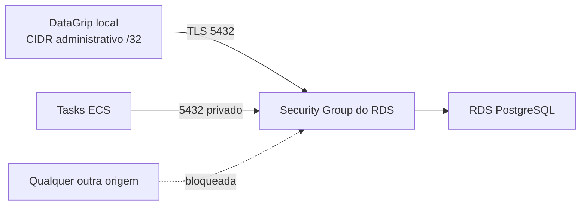

# Acesso administrativo temporário ao RDS da demo

> Planeje a partir deste documento. Cada slice abaixo carrega sua forma: copie-a, não a redesenhe.
> Status: confirmado pelo responsável pela demo, 2026-09-23

## Situation

- Projeto: em construção ativa, com a demo AWS já definida em Terraform.
- Decisão: acesso administrativo remoto direto ao PostgreSQL da demo, confirmado pelo responsável pela demo em 2026-09-23, para uma janela de dois dias.
- Em andamento: a demo mantém RDS, ECS e Valkey privados como padrão; a exceção cobre somente o RDS e não altera a borda HTTP, as filas ou o cache.
- Em risco: uma configuração excessivamente fechada impede a correção durante a demonstração; uma configuração ampla expõe dados e uma superfície administrativa à Internet.

## Problem

O responsável pela demo não consegue inspecionar nem corrigir os dados efetivamente publicados com seu DataGrip local: o RDS atual só aceita tráfego das tasks ECS. O substituto — o PostgreSQL do Docker Compose — não contém nem corrige o estado da demo AWS. A necessidade é imediata porque a demonstração dura dois dias e exige capacidade de diagnosticar e corrigir dados, inclusive DDL, sem depender de outro operador.

O valor que muda o risco é uma única origem administrativa: o CIDR público atual foi informado fora do repositório e deve ser passado somente por `demo.tfvars` ignorado pelo Git, como `/32`.

## Success

- Funciona se: durante a janela da demo, o responsável consegue conectar o DataGrip por TLS e executar a administração necessária no PostgreSQL publicado, enquanto qualquer outro endereço IP não consegue abrir uma conexão ao banco.
- Sinal de problema: mudança de IP público impede a conexão, ou uma tentativa fora do CIDR chega ao PostgreSQL.
- Revisão: antes de 2026-09-25, pelo responsável pela demo; o acesso é revogado ou toda a demo é destruída.

## Boundary

Em: acesso TCP administrativo direto do DataGrip ao RDS PostgreSQL, limite por CIDR, TLS, recuperação da credencial mestre no Secrets Manager e revogação explícita.

Fora: acesso administrativo ao Valkey, novas APIs, alterações no schema funcional, acesso de mais de um operador, VPN, bastion e túnel de sessão.

Inalterado: regras ECS→RDS, o RDS como fonte de verdade, a autenticação da API Gateway e todos os dados e contratos da aplicação.

## Prior art

- O RDS já usa uma senha mestre gerenciada pelo Secrets Manager e criptografia em repouso; o acesso temporário preserva esses controles.
- A AWS exige que um RDS público use subnets com rota ao Internet Gateway e que o Security Group conceda entrada à origem correta; o desenho adota ambas as condições, sem abrir uma faixa ampla.
- O acesso por túnel privado é mais apropriado quando o acesso for duradouro ou a origem não puder ser limitada; essa não é a condição desta demonstração de dois dias.

## Shape

O RDS PostgreSQL da demo ganha um endpoint público somente durante a janela administrativa, enquanto os demais componentes de dados continuam privados. O Security Group mantém o acesso das tasks ECS e adiciona uma única origem administrativa, lida de entrada local ignorada pelo Git. O DataGrip usa o endpoint do RDS, TLS e a credencial mestre que a AWS mantém no Secrets Manager. Desativar a exceção ou destruir a demo remove o caminho externo; a alternativa de túnel privado só vence se o operador não puder manter uma origem IPv4 única.

## Key decisions

1. **A entrada administrativa aceita exatamente um CIDR IPv4 `/32`, fornecido localmente, e nunca `0.0.0.0/0`.** O valor atual é operacional e não entra em arquivos versionados; a mudança de IP exige substituir o `/32` e reaplicar a configuração.
2. **Somente o RDS PostgreSQL recebe alcance público temporário.** Valkey, filas, ALB e ECS mantêm as respectivas redes privadas.
3. **A sessão do DataGrip usa a credencial mestre gerenciada pelo RDS, com privilégios administrativos compatíveis com o serviço.** Não há uma conta limitada nesta janela porque o responsável precisa corrigir qualquer incidente da demo.
4. **Toda conexão administrativa usa TLS com validação da CA e do hostname do RDS, e a configuração aplicada verifica que `rds.force_ssl` está habilitado.** Uma conexão sem TLS ou sem verificação do servidor não é uma configuração válida para o DataGrip.
5. **A exposição é uma opção explícita, sem valor permissivo padrão, e é removida manualmente antes da destruição ou pela destruição da demo.** Não há desligamento automático que possa cortar o acesso durante um incidente.
6. **Senha, valor do CIDR e qualquer material de conexão permanecem fora do Git.** O Terraform recebe apenas o CIDR por arquivo ignorado; a senha é consultada no Secrets Manager por uma identidade AWS autorizada.

## Work

| Slice | Entrega | Status |
|---|---|---|
| [RDS PostgreSQL](#rds-postgresql) | Um caminho administrativo temporário, TLS e limitado a uma única origem, sem ampliar a superfície dos demais recursos. | clear |

Order: RDS PostgreSQL.

Already handled by existing code: operações da aplicação → ECS continua acessando o PostgreSQL pelo Security Group da VPC.

Derivable from the repository, left to the plan: nomes de recursos, estrutura dos módulos Terraform e estilo dos testes — todos seguem a demo existente.

### RDS PostgreSQL

**Entrega** O responsável administra o banco publicado no DataGrip durante a janela de dois dias. **Status: clear.** Aplica as decisões 1 a 6.

| Estado | O que deve acontecer | O operador vê |
|---|---|---|
| Origem administrativa cadastrada e RDS disponível | O Security Group permite TCP 5432; o PostgreSQL exige TLS e autentica a credencial mestre. | Conexão bem-sucedida no DataGrip e administração completa do banco. |
| Origem diferente da cadastrada | O Security Group descarta o tráfego antes de o PostgreSQL receber uma tentativa de autenticação. | Falha de conexão, sem prompt de senha do PostgreSQL. |
| IP público do operador mudou | A configuração aceita somente o novo `/32` após atualização deliberada da entrada local. | A conexão volta após a atualização; nunca há ampliação temporária para uma faixa aberta. |
| RDS parado pelo controle de custo | Nenhuma conexão é aceita até o operador iniciar o RDS pela AWS; a política não altera dados nem abre uma origem adicional. | Falha de conexão até a instância ficar disponível. |
| Acesso administrativo desativado ou demo destruída | O endpoint público ou os recursos deixam de existir; não sobra permissão administrativa externa. | Falha de conexão esperada. |

Alternatives considered: túnel privado para uma instância de administração — vence se a janela deixar de ser temporária, se houver mais de uma rede administrativa ou se o IPv4 do operador não puder ser mantido em `/32`.

## Sources

- [Estado e decisões da demo](../.specs/STATE.md) — a demo publicada usa RDS PostgreSQL como fonte de verdade e preserva controles de custo.
- [Módulo do plano de dados](../infra/modules/data-plane/README.md) — senha mestre no Secrets Manager, criptografia e topologia privada atual.
- [AWS: acesso público ou privado ao RDS](https://docs.aws.amazon.com/AmazonRDS/latest/gettingstartedguide/security-public-private.html) — entrada limitada a IPs confiáveis para instâncias públicas.
- [AWS: RDS em VPC](https://docs.aws.amazon.com/AmazonRDS/latest/UserGuide/USER_VPC.WorkingWithRDSInstanceinaVPC.html) — subnets públicas e regras do Security Group são requisitos para um RDS publicamente acessível.
- [AWS: SSL no RDS PostgreSQL](https://docs.aws.amazon.com/AmazonRDS/latest/UserGuide/PostgreSQL.Concepts.General.SSL.html) — `rds.force_ssl` vem habilitado por padrão no PostgreSQL 15 ou posterior.
