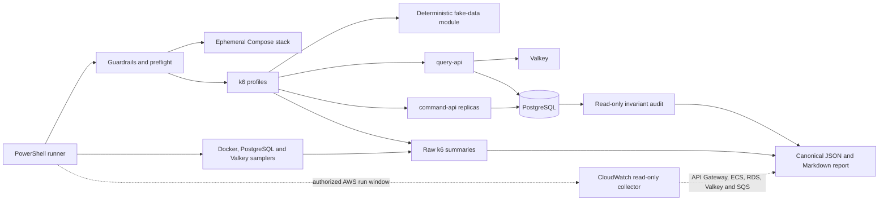

# Design da carga com dados fake dinâmicos

**Spec:** `.specs/features/dynamic-fake-load/spec.md`
**Context:** `.specs/features/dynamic-fake-load/context.md`
**Status:** Draft

---

## Architecture Overview

A suíte estende o harness k6 existente com um runner único e perfis separados. O runner controla a stack Compose, valida o destino, executa preflight, coleta séries temporais e normaliza evidência. Os workloads compartilham o mesmo gerador determinístico e as mesmas métricas, evitando divergência entre smoke, stress, spike, capacity e soak.



---

## Approach Decision

| Approach | Trade-off | Verdict |
| --- | --- | --- |
| Um script por tipo, com geração duplicada | Simples no início, mas thresholds, dados e classificação divergem rapidamente. | Rejected |
| Um engine k6 modular com perfis declarativos e runner PowerShell | Reutiliza o baseline, mantém semântica única e permite executar um perfil por vez. | Selected |
| Ferramenta Java dedicada | Compartilha a stack, mas mistura código de teste de carga ao artefato de produção e aumenta manutenção. | Rejected |

---

## Code Reuse Analysis

### Existing Components to Leverage

| Component | Location | How to Use |
| --- | --- | --- |
| Runner do baseline | `performance/demo/run.ps1` | Reaproveitar descoberta de réplicas, health checks, proveniência, publicação protegida e teardown. |
| Scripts k6 atuais | `performance/demo/query.js`, `command.js`, `mixed.js` | Reaproveitar contratos HTTP, thresholds iniciais e distribuição explícita entre command-api. |
| Stack concorrente | `compose.yaml` | Subir duas réplicas command-api com portas efêmeras. |
| Contratos da API | `src/main/java/com/cielo/flashbooking/*/controller/` | Respeitar limites de nome, e-mail, quantidade e Idempotency-Key. |
| Schema autoritativo | `src/main/resources/db/migration/V1__create_flash_booking_schema.sql` | Executar auditoria somente leitura sobre constraints e relações existentes. |

### Integration Points

| System | Integration Method |
| --- | --- |
| query-api | HTTP loopback para `GET /events/{id}` e `GET /reservations/{id}`. |
| command-api | HTTP loopback distribuído entre ao menos duas URLs para POST/DELETE. |
| PostgreSQL | `psql` somente leitura para série de conexões/waits e auditoria final. |
| Valkey | `valkey-cli INFO stats` para hits e misses acumulados. |
| Docker | `docker stats --no-stream` para CPU e RSS por container. |
| CloudWatch | `GetMetricData` somente leitura sobre uma janela UTC informada pelo operador, para correlação de uma carga AWS autorizada externamente. |

---

## Components

### Configuration and Guardrails

- **Purpose:** Validar perfil, workload, seed, taxas, durações, limites e URLs antes de iniciar carga.
- **Location:** `performance/dynamic-load/lib/config.js`
- **Interfaces:**
  - `loadConfig(environment): LoadConfig` - converte variáveis em configuração tipada e limitada.
  - `assertSafeTarget(config): void` - aceita somente `localhost`, `127.0.0.1` e `[::1]` nesta versão.
- **Dependencies:** variáveis k6 e valores fornecidos pelo runner.
- **Reuses:** thresholds do baseline e portas descobertas pelo runner atual.

### Deterministic Fake Data

- **Purpose:** Criar massa sintética válida, reproduzível e sem PII.
- **Location:** `performance/dynamic-load/lib/fake-data.js`
- **Interfaces:**
  - `createGenerator(seed, runId): FakeDataGenerator`
  - `eventFixture(index, plannedCommands): EventPayload`
  - `customer(vu, iteration): CustomerPayload`
  - `idempotencyKey(operation, vu, iteration): string`
  - `selectEvent(vu, iteration): WeightedEvent`
- **Dependencies:** PRNG determinístico implementado no próprio módulo.
- **Reuses:** limites dos DTOs Java e domínio `example.com`.

### Stateful Workload Engine

- **Purpose:** Executar fluxos por workload, manter IDs de reserva dentro do VU e classificar resultados.
- **Location:** `performance/dynamic-load/workload.js`
- **Interfaces:** entry points k6 `setup`, scenario functions e `handleSummary`.
- **Dependencies:** config, fake-data, HTTP k6, checks, custom metrics e dados retornados pelo setup.
- **Reuses:** endpoints e round-robin explícito de `performance/demo/*.js`.

### Profile Definitions

- **Purpose:** Traduzir `smoke`, `stress`, `spike`, `capacity`, `load` e `soak` em executors k6 e thresholds.
- **Location:** `performance/dynamic-load/lib/profiles.js`
- **Interfaces:** `buildOptions(config, discoveredCapacity): k6.Options`.
- **Dependencies:** configuration module.
- **Reuses:** `constant-vus` apenas no smoke; perfis de taxa usam arrival-rate para não esconder saturação por coordinated omission.

### Orchestrator and Telemetry Collector

- **Purpose:** Subir/destruir Compose, descobrir endpoints, serializar perfis, amostrar dependências e preservar evidência parcial.
- **Location:** `performance/dynamic-load/run.ps1`
- **Interfaces:** parâmetros `Profile`, `Workload`, `Publish`, `Seed` e limites opcionais.
- **Dependencies:** Docker, k6, Git e `psql` via container.
- **Reuses:** funções de saúde, proveniência e publicação do runner do baseline.

### Evidence Normalizer

- **Purpose:** Combinar summaries k6, telemetria, configuração e audit em um contrato canônico.
- **Location:** `performance/dynamic-load/normalize.ps1`
- **Interfaces:** entrada por diretório de execução; saída `result.json` e `report.md`.
- **Dependencies:** arquivos JSON/CSV produzidos pelo runner.
- **Reuses:** campos de ambiente de `performance/demo/baseline.json`.

### CloudWatch Correlation Adapter

- **Purpose:** Buscar evidência de infraestrutura da demo AWS sem gerar tráfego nem criar recursos.
- **Location:** `performance/dynamic-load/cloudwatch.ps1`
- **Interfaces:** `Read-CloudWatchEvidence -StartUtc -EndUtc -Region -ResourceNames`.
- **Dependencies:** AWS CLI autenticada com permissão somente leitura `cloudwatch:GetMetricData` e nomes de recursos declarados pelo ambiente autorizado.
- **Reuses:** métricas detalhadas do API Gateway e o dashboard `flash-booking-demo-demo` já definidos em `infra/modules/edge-observability/`.

---

## Data Models

### LoadConfig

```text
profile: smoke | stress | spike | capacity | load | soak
workload: query-heavy | command-heavy | mixed
seed: integer
runId: string
queryBaseUrl: loopback URL
commandBaseUrls: at least two loopback URLs for non-smoke profiles
rate: positive integer when required
stepRate: positive integer for stress
maxRate: bounded positive integer for stress/spike
duration: profile-bound duration
forecastSource: non-empty string required only for load
```

### CanonicalResult

```text
schemaVersion, capturedAt, sourceCommit, dirtyAtStart
environment { os, cpu, memory, docker, compose, k6, image, containerCounts }
input { profile, workload, seed, runId, rates, durations, thresholds, forecastSource? }
http { perRouteAndPhase { requests, p50, p95, p99, technicalFailureRate, businessRejections } }
telemetry { containers[], postgres[], valkey[] }
cloudwatch? { runWindowUtc, API Gateway[], ECS[], RDS[], Valkey[], SQS[], incompleteSeries[] }
audit { availableNonNegative, quantitiesPositive, inventoryBalanced, evidenceComplete }
verdict { status, sustainableRate?, bottleneck, limitations[] }
```

Raw output stays ignored under `performance/dynamic-load/results/`. Only an explicitly published canonical JSON and its Markdown report are versioned.

---

## Scenario Matrix

| Type | Required now? | Workloads | Default shape | Promotion rule |
| --- | --- | --- | --- | --- |
| Smoke | Yes | mixed lifecycle | 1 VU, one complete cycle, max 60 s | Must pass before every other profile. |
| Stress | Yes | query-heavy, command-heavy, mixed | 30 s warm-up; 60 s steps until breach or safe ceiling | Establishes one sustainable rate per workload. |
| Spike | Yes | mixed | 30 s at 20%, 60 s at 120%, 60 s at 20% | Requires a mixed sustainable rate. |
| Capacity | Yes | each measured workload | 30 min at 60% of its sustainable rate | Provisional local operating point. |
| Load | Not without forecast | approved production mix | approved rate and duration | Requires rate, mix, source and authorized target. When run in AWS, attach CloudWatch correlation. |
| Soak | P2 | mixed | 2 h at 60% of mixed sustainable rate | Runs only after all short gates pass. |

---

## PostgreSQL Observation and Audit

The sampler uses short, read-only statements and never holds a transaction open during the workload.

| Evidence | Query intent | Interpretation |
| --- | --- | --- |
| Connections and waits | Count sessions and `wait_event_type = 'Lock'` for the application database. | Time series reveals pool pressure and lock contention; a final snapshot alone is insufficient. |
| Transaction rate | Read deltas from `pg_stat_database`. | Correlates accepted commands with database work. |
| Inventory audit | Assert `event.capacity - event.available = sum(reservation.quantity WHERE status = 'PENDING')` per event and non-negative availability. | Secondary audit of persisted invariants; it does not replace concurrency integration tests. |
| Table growth | Count customer, reservation, idempotency and outbox rows at profile boundaries. | Distinguishes expected data accumulation from unexplained resource growth. |
| CloudWatch correlation | Query one-minute API Gateway, ECS, RDS, Valkey and SQS series from five minutes before through ten minutes after an externally authorized AWS run. | Correlates client behavior to infrastructure; missing data is evidence incompleteness, not component health. |

No schema, index, partition or PostgreSQL setting changes belong to this feature.

---

## Error Handling Strategy

| Error Scenario | Handling | User Impact |
| --- | --- | --- |
| Non-loopback target | Reject before starting Compose or k6. | No remote traffic is sent. |
| Smoke or health failure | Abort remaining profiles and preserve logs. | Fast actionable failure. |
| Threshold breach in stress | Stop progression after the failing step. | Previous passing step becomes the sustainable limit. |
| Expected business rejection | Count in a dedicated metric; invalidate a capacity run if caused by accidental inventory exhaustion. | Technical error rate remains meaningful. |
| Telemetry sampler failure | Continue workload, mark evidence incomplete and prevent canonical publication. | No false complete report. |
| CloudWatch query failure or late metric | Preserve the query result and mark only remote correlation incomplete. | The k6 result remains valid for its own target and window. |
| k6 or runner interruption | `finally` stops Compose; partial files remain. | Clean local environment with diagnostic evidence. |
| Generator saturation | Mark `generator-bound`. | No application capacity claim. |

---

## Risks & Concerns

| Concern | Location | Impact | Mitigation |
| --- | --- | --- | --- |
| Baseline dura apenas 15 s e captura PostgreSQL só no fim. | `performance/demo/run.ps1`, `performance/demo/README.md` | Não revela estabilidade, lock waits transitórios ou vazamento. | Perfis longos e amostragem temporal separada. |
| Resultado histórico não provou multiprocesso. | `performance/demo/README.md` | Vazão pode refletir uma única command-api. | Exigir duas URLs distintas antes de perfis não smoke e registrar contagem. |
| O mesmo evento concentra atualizações na linha de inventário. | `src/main/resources/db/migration/V1__create_flash_booking_schema.sql` | Um único hot row pode dominar o limite. | Medir hot/warm/cold e publicar o workload junto do resultado. |
| Clientes e idempotência acumulam durante testes prolongados. | `V1__create_flash_booking_schema.sql`, `application.yml` | Crescimento de tabelas pode afetar soak e disco local. | Dimensionar o teto, registrar contagem de linhas e destruir a stack efémera. |
| Actuator expõe somente health. | `src/main/resources/application.yml` | RSS do container não prova vazamento de heap JVM. | Rotular RSS como indicador e adiar heap direto para feature futura. |
| Arrival-rate pode saturar a máquina geradora. | k6 local | O teste atribuiria um limite falso à aplicação. | Registrar dropped iterations, CPU do host e classificar `generator-bound`. |
| CloudWatch recebe as métricas do API Gateway e ECS em períodos de um minuto. | AWS documenta métricas de um minuto para API Gateway e ECS. | A série não substitui a latência por requisição do k6 e pode chegar depois do fim do run. | Consultar janela acolchoada em UTC, guardar pontos brutos e correlacionar apenas por tempo. |

---

## Tech Decisions

| Decision | Choice | Rationale |
| --- | --- | --- |
| Gerador fake | PRNG pequeno e determinístico no repositório | Sem PII, dependência ou rede; reprodução por seed. |
| Modelo de carga | Arrival-rate para stress/spike/capacity/soak | Mantém a taxa oferecida independente do tempo de resposta e expõe dropped iterations. |
| Ambiente v1 | Compose local e efêmero | Alinha com AD-006 e elimina risco/custo remoto. |
| Resultado | JSON canônico + relatório Markdown | Um formato serve automação; o outro, revisão humana. |
| Banco | Observação e audit somente leitura | Mede contenção sem otimização prematura ou alteração de schema. |
| AWS remoto | CloudWatch read-only como trilha de correlação | Aproveita dashboard e métricas existentes sem liberar o harness para enviar carga remota. |
