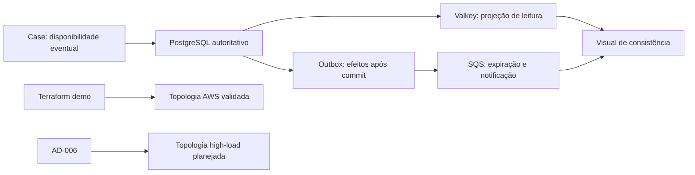

# AWS Eventual Consistency Visuals Design

**Spec:** `.specs/features/eventual-consistency-aws-visuals/spec.md`
**Status:** Approved

## Architecture Overview

As novas vistas explicam a mesma versão 1 por três ângulos. O diagrama de consistência mostra semântica e tempo. A topologia demo mostra os recursos realmente provisionados. A topologia high-load mostra somente a evolução planejada.

## Code Reuse Analysis

| Fonte | Local | Uso no visual |
| --- | --- | --- |
| Requisito original | `Case BackEnd 1.md:27` | Define consistência eventual para disponibilidade. |
| Contrato da demo | `.specs/features/flash-booking-demo/spec.md` | Define TTL, prazos, filas, DLQs e limites de evidência. |
| Transação de reserva | `CreateReservationService` e `JdbcReservationPersistenceAdapter` | Mostra inventário, reserva e dois eventos no mesmo commit. |
| Cache-aside | `GetEventService` e `EventAvailabilityInvalidationListener` | Mostra hit/miss, fallback, invalidação AFTER_COMMIT e TTL. |
| Publicação | `OutboxSqsPublisher` | Mostra polling, duas filas e permanência do evento em falha. |
| Infraestrutura demo | `infra/modules/*` | Lista somente recursos presentes no Terraform. |
| Decisões | `.specs/STATE.md` | Mantém high-load como alvo não provisionado. |

## Visual System

- Canvas `1600 × 980` para consistência e `1600 × 900` para topologias.
- Texto SVG nativo com Montserrat, Segoe UI e Arial como fallbacks.
- Fundo claro; Azul Cielo `#00AEEF` e azul profundo `#204986` para hierarquia.
- Acento AWS `#FF9900` somente em badges e cabeçalhos de serviços.
- Fluxo forte: linha sólida azul-escura.
- Convergência de cache: linha tracejada ciano.
- Efeito assíncrono: linha tracejada magenta.
- Observabilidade: linha pontilhada cinza.
- Toda seta usa segmentos horizontais/verticais em gutters reservados. Nenhuma seta atravessa texto ou caixa.
- Cada linha de texto tem posição explícita. Não usar `foreignObject`, texto em path ou rasterização.

## View 1: Consistency Boundary

Três faixas horizontais:

1. **Comando forte:** cliente, API Gateway, Command API, transação PostgreSQL e resposta `201 PENDING`.
2. **Disponibilidade eventual:** Query API, Valkey e PostgreSQL; hit pode refletir estado por até um segundo, miss consulta a fonte de verdade, reserva não passa pelo cache.
3. **Efeitos após commit:** outbox, publisher, filas de expiração/notificação, consumidores, DLQs, SES e reconciliador.

Uma coluna lateral resume os prazos observáveis: cache `≤ 1s`, expiração `expiresAt + 5s` saudável e solicitação SES `≤ 30s` saudável.

## View 2: Demo AWS

Quatro colunas sem cruzamento:

- **Edge:** cliente, WAF + API Gateway REST, VPC Link v2, ALB interno.
- **Compute:** Query API, Command API e worker, uma task ECS por serviço.
- **Data/async:** Valkey single-node, RDS PostgreSQL Single-AZ, SQS + DLQs e SES.
- **Operations:** Secrets Manager, CloudWatch e AWS Budgets.

O cabeçalho mostra VPC em duas AZs, workloads privados, um NAT Gateway e o status `APLICADA · VALIDADA · DESTRUÍDA`.

## View 3: High-load Target

Repete as quatro colunas para facilitar comparação, mas troca apenas topologia e escala:

- múltiplas tasks ECS por serviço em pelo menos duas AZs;
- autoscaling separado por leitura, comandos e backlog/idade;
- Aurora PostgreSQL + RDS Proxy;
- Valkey Multi-AZ;
- NAT por AZ e filas/DLQs separadas.

O cabeçalho e o rodapé repetem `ARQUITETURA-ALVO · NÃO PROVISIONADA · SEM CAPACIDADE MEDIDA`.

## README Integration

A seção `Consistência eventual e peças AWS` entra depois de `Como o último ingresso é protegido`. A vista de consistência permanece aberta porque responde ao requisito do case. As topologias demo e high-load ficam em dois `
` imediatamente abaixo, preservando a divulgação progressiva. Os quatro deep dives C4/sequence existentes permanecem.

## Validation Strategy

| Risco | Gate |
| --- | --- |
| Fato arquitetural inventado | Tokens obrigatórios comparados com spec, código e Terraform. |
| SVG inválido | Parse XML de todos os SVGs do README. |
| Texto cortado | Render Chrome headless em resolução nativa e inspeção visual. |
| Seta ambígua | Inspeção visual e rotas ortogonais definidas no SVG. |
| Link quebrado | `scripts/validate-readme.ps1`. |
| Asset órfão | Inventário de `docs/images` contra referências fora do próprio validador. |
| Gate superficial | Sensor altera um limite ou status obrigatório e exige falha. |

## Risks & Concerns

| Risco | Impacto | Controle |
| --- | --- | --- |
| Confundir disponibilidade eventual com inventário eventual | Sugere possibilidade de oversell | RDS aparece como autoridade e cache nunca participa do comando. |
| Confundir invalidação com garantia de entrega | Oculta janela de cache stale | Invalidação é rotulada best effort; TTL limita convergência. |
| Confundir SQS com transação | Sugere dual write | Outbox aparece dentro do commit; publicação começa depois. |
| Excesso de detalhes | Recria a ilegibilidade dos PNGs antigos | Cada vista responde uma pergunta e usa no máximo quatro colunas. |
| High-load parecer executada | Exagera evidência | Status não provisionado aparece no título, badge e rodapé. |

## Tech Decisions

| Decisão | Escolha | Racional |
| --- | --- | --- |
| Separar semântica e topologia | Três SVGs | Uma imagem única ficaria densa e repetiria o problema antigo. |
| Manter C4 existente | Sim | Componentes Java continuam úteis e não competem com a vista AWS. |
| Não usar ícones raster AWS | Service cards vetoriais com nomes oficiais | Mantém texto nítido, acessível e sem dependência externa. |
| Limpar apenas assets comprovadamente obsoletos | Quatro alvos explícitos | Evita apagar material ainda referenciado ou em edição. |

Nenhuma decisão altera comportamento do sistema. A feature apenas torna visível o contrato já definido por AD-006, AD-009, AD-010, AD-015 e AD-016.
