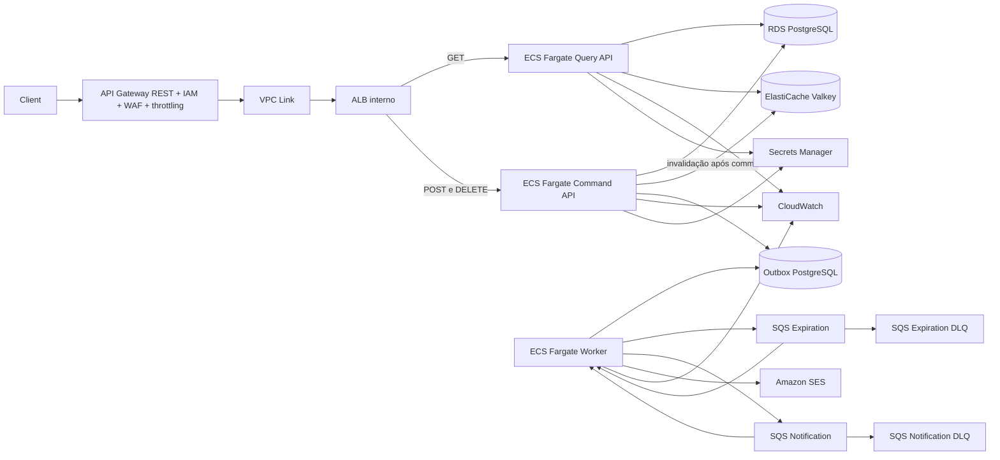
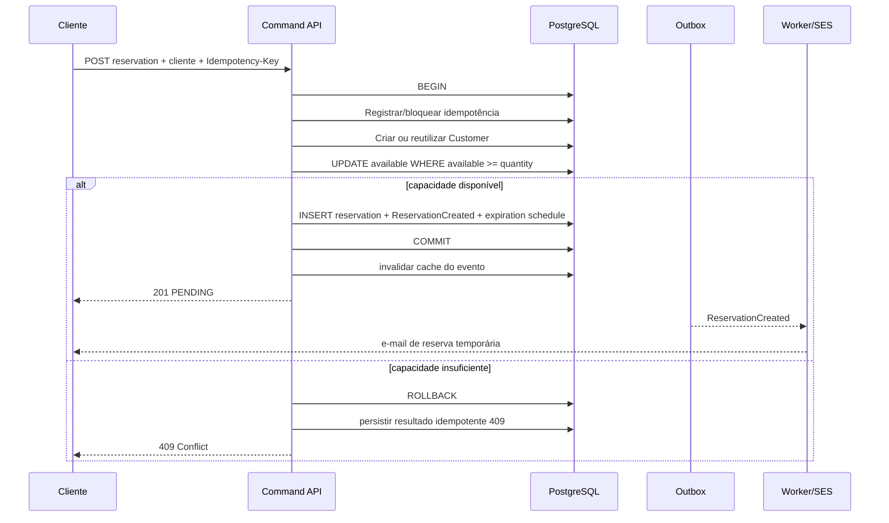
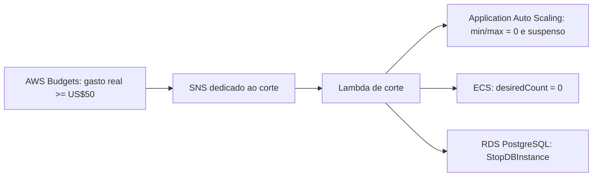

# Design da demo Flash Booking

**Especificação:** `.specs/features/flash-booking-demo/spec.md`
**Estado:** Validated

## Visão geral da arquitetura

A aplicação será um monólito modular empacotado uma vez. A mesma imagem inicia como `query-api`, `command-api` ou `worker`. Consultas e comandos são serviços ECS separados desde a demo para que a arquitetura e o código não precisem mudar quando a carga crescer. O modo apenas ativa controllers e consumidores; regras de domínio, casos de uso, schema e migrations são os mesmos.

## Componentes

### Domínio

- **Responsabilidade:** Regras de evento, cliente, reserva, capacidade, estados e idempotência.
- **Local:** `src/main/java/.../domain/`
- **Dependências:** Nenhuma dependência de Spring ou AWS.

### Aplicação

- **Responsabilidade:** Casos de uso e limites transacionais.
- **Local:** `src/main/java/.../application/`
- **Interfaces:** criar/consultar evento, criar/consultar/cancelar reserva, expirar reserva, publicar outbox e enviar notificação.

### Controllers HTTP

- **Responsabilidade:** Expor os cinco endpoints, validar o contrato e mapear Problem Details.
- **Local:** `src/main/java/.../controller/event/`, `src/main/java/.../controller/reservation/` e `src/main/java/.../controller/error/`.
- **Dependências:** Spring Web, Bean Validation e casos de uso da aplicação; controllers não acessam repositories ou SDKs AWS.
- **Ativação:** GETs no modo `query-api`; POSTs e DELETE no modo `command-api`.

### Integração PostgreSQL

- **Responsabilidade:** Persistir agregados e executar atualização condicional atômica.
- **Local:** `src/main/java/.../adapter/out/persistence/`
- **Dependências:** Spring JDBC e Flyway. PostgreSQL e SQL explícito são a única pilha de persistência.

### Integração de mensageria

- **Responsabilidade:** Publicar e consumir expirações e notificações por filas SQS separadas.
- **Local:** `src/main/java/.../adapter/out/messaging/`
- **Dependências:** AWS SDK for Java.

### Integração de cache de disponibilidade

- **Responsabilidade:** Aplicar cache-aside à consulta de evento e invalidar sua disponibilidade depois de commits que alterem o estoque.
- **Local:** `src/main/java/.../adapter/out/cache/`
- **Dependências:** Cliente Valkey/Redis configurado por endpoint e porta. A demo usa os limites fixos do contrato abaixo; a arquitetura futura pode externalizá-los como configuração operacional.
- **Contrato:** `event-availability:{id}` expira em no máximo um segundo. Cache não autoriza comandos e sua falha consulta PostgreSQL com proteção definida no ADR 0005. A consulta de reserva não usa cache e retorna o evento somente como `{id, name}`.

### Integração de e-mail

- **Responsabilidade:** Consumir `ReservationCreated` e enviar confirmação de reserva temporária.
- **Local:** `src/main/java/.../notification/email/`.
- **Dependências:** Amazon SES na AWS e Mailpit no Docker Compose. O consumidor adquire um lease curto no PostgreSQL, chama o provedor sem transação aberta e conclui o estado em outra transação curta. Registros terminais de notificação e outbox são removidos em lotes após a retenção.
- **Contrato:** Falha de e-mail usa retry, DLQ e alarme, sem reverter a reserva; ADR 0011.
- **Isolamento:** Timeout, executor e listener próprios impedem que lentidão do SES consuma as threads reservadas à expiração.

## Modelagem de dados

A modelagem completa, relações, constraints, índices e contrato HTTP estão em [docs/data-model.md](../../../docs/data-model.md). O schema é idêntico nas duas arquiteturas.

### Event

- `id: UUID`
- `name: String`
- `capacity: int`
- `available: int`
- `startsAt: Instant?`, onde `null` representa venda imediata
- `endsAt: Instant?`, onde `null` representa venda sem encerramento temporal
- `createdAt: Instant`, decidido pelo PostgreSQL

`startsAt` precisa ser posterior a `createdAt`. Com início, `endsAt` precisa ser posterior ao início; sem início, fim precisa ser no mínimo dez minutos posterior à criação. A criação devolve os valores persistidos e `GET /events/{id}` os preserva no cache de evento.

### Reservation

- `id: UUID`
- `eventId: UUID`
- `customerId: UUID`
- `quantity: int`
- `status: PENDING | CANCELLED | EXPIRED`
- `expiresAt: Instant`
- `createdAt: Instant`
- `updatedAt: Instant`
- `closureReason: { code, description } | null`; obrigatório e imutável em CANCELLED e EXPIRED, nulo em PENDING, conforme [ADR 0006](../../../docs/adr/0006-catalogo-de-motivos-de-encerramento.md).

### Customer

- `id: UUID`
- `name: String`
- `email: String`
- `createdAt: Instant`
- `updatedAt: Instant`

Um cliente realiza várias reservas; cada reserva pertence a exatamente um cliente e um evento. O Java trata o endereço antes da validação, busca e persistência, e o banco armazena somente a forma canônica na coluna única `email`. O vínculo é persistido na criação, conforme ADR 0010.

### IdempotencyRecord

- `Idempotency-Key` é globalmente única durante a janela; operação, alvo normalizado e hash do payload formam a impressão digital usada para distinguir replay de conflito.
- Armazena status HTTP, resposta serializada, criação e vencimento após 24 horas, ambos medidos pelo PostgreSQL.
- A aquisição insere uma chave nova ou substitui atomicamente o registro vencido. A restrição única e o `ON CONFLICT` serializam chamadas concorrentes; somente a vencedora executa o comando. A substituição inicia a nova janela com `clock_timestamp()` depois de conquistar o lock, sem descontar o tempo de espera.
- O worker remove até 500 registros vencidos a cada cinco segundos por padrão, com tamanho e intervalos tipados em `idempotency.cleanup` e aquisição via `FOR UPDATE SKIP LOCKED`. A limpeza é manutenção de retenção: atraso ou concorrência com uma nova aquisição não prolonga a janela nem apaga uma chave reativada.
- O desenho segue o [ADR 0007](../../../docs/adr/0007-idempotencia-persistente-de-comandos.md).

A configuração de limpeza usa `batch-size` entre 1 e 10.000, `fixed-delay` positivo e `initial-delay` não negativo. Valores ausentes usam 500 linhas e cinco segundos; valores explícitos inválidos impedem o startup. Overrides de ambiente usam `IDEMPOTENCY_CLEANUP_BATCHSIZE`, `IDEMPOTENCY_CLEANUP_FIXEDDELAY` e `IDEMPOTENCY_CLEANUP_INITIALDELAY`, com unidades explícitas de duração. Mudanças exigem reinício, sem refresh dinâmico.

A seleção de limpeza compara `expires_at` com `statement_timestamp()`, um cutoff estável do banco que permite o acesso por índice. A exclusão revalida o vencimento e os locks são mantidos até o fim dessa única instrução atômica. Criação de reserva e reaproveitamento de cliente também observam a identidade e o relógio persistidos no PostgreSQL.

### OutboxEvent

- Identificador, tipo, agregado, payload, tentativas e instante de publicação.
- Gravado na mesma transação da reserva.

## Fluxos críticos

### Reserva

O caminho de capacidade insuficiente não deixa a chave em aberto: após a tentativa transacional sem efeito, grava a resposta final `409` no registro de idempotência. Falhas transitórias `5xx` não são armazenadas como resultado final. A validade é avaliada na aquisição pelo relógio do PostgreSQL; a leitura subsequente do registro existente pertence à mesma decisão transacional e não reabre a disputa na fronteira do vencimento.

### Defesa contra oversell

A proteção não depende de sincronização Java, quantidade de containers, cache ou ordem de chegada no API Gateway. Ela pertence ao PostgreSQL:

1. Cada reserva tenta decrementar `available` com uma única atualização condicional que exige `available >= quantity`, início ausente ou alcançado, e fim ausente ou ainda não alcançado pelo relógio PostgreSQL.
2. O banco conquista lock sobre a linha do evento e reavalia a condição depois de aguardar outra transação; somente operações que ainda cabem alteram uma linha.
3. Cliente, reserva, outbox e decremento são confirmados juntos. Qualquer erro desfaz todos os efeitos.
4. A constraint `0 <= available <= capacity` oferece uma segunda barreira contra valores impossíveis.
5. O comando de encerramento conquista o lock da reserva e só então observa o relógio PostgreSQL: `DELETE` antes do prazo materializa `CANCELLED`; `DELETE`, consumidor ou reconciliador em `expiresAt` ou depois materializam `EXPIRED`. Somente quem alterar `PENDING` incrementa o estoque na mesma transação.
6. Idempotência impede que retries do mesmo comando criem novas reservas ou devolvam capacidade novamente.

Com carga muito alta no mesmo evento, as transações se enfileiram na linha quente. Isso pode aumentar p95/p99 ou produzir timeout, mas não justifica relaxar a regra: o sistema degrada ou rejeita antes de aceitar uma reserva sem capacidade. A arquitetura alta mantém exatamente esse algoritmo e mede quando a contenção passa a violar o SLO.

### Expiração

O publisher calcula `DelaySeconds` a partir de `expiresAt`, limitado a 15 minutos. O consumidor executa uma transição condicional. Um reconciliador periódico consulta reservas vencidas para cobrir falhas de publicação e mensagens na DLQ.

Conforme [ADR 0003](../../../docs/adr/0003-prazo-de-liberacao-de-reservas-expiradas.md) e [ADR 0008](../../../docs/adr/0008-relogio-do-banco-para-expiracao.md), concluir a transição, a gravação do motivo e a devolução de capacidade na mesma transação até expiresAt + 5 segundos em operação saudável. O relógio PostgreSQL decide a elegibilidade; mensagem antecipada não autoriza expiração antes de expiresAt e o reconciliador varre candidatos ao menos a cada segundo. A janela não estende a validade e não define a defasagem de caches.

O `DELETE` participa da mesma regra temporal. A persistência bloqueia a reserva pendente, amostra o relógio do banco depois do lock e encerra como `CANCELLED` apenas se esse instante ainda for anterior a `expiresAt`; caso contrário, encerra como `EXPIRED`. A resposta `200` contém o estado terminal efetivamente persistido. Isso impede que uma requisição iniciada antes do prazo, mas desbloqueada depois dele, registre um cancelamento tardio.

## Tratamento de erros

| Cenário | Tratamento | Impacto HTTP |
| --- | --- | --- |
| Entrada inválida | Bean Validation | 400 |
| Recurso inexistente | Exceção de domínio mapeada | 404 |
| Capacidade insuficiente | Update condicional sem linha afetada | 409 |
| Chave idempotente conflitante | Comparação de hash | 409 |
| Dependência indisponível | Rollback e Problem Details | 500/503 |
| Falha assíncrona | Retry e DLQ | Sem alterar resposta já persistida |

## Organização Terraform

- `infra/bootstrap/`: bucket S3 criptografado e versionado para state.
- `infra/environments/demo/`: root com backend S3 declarado, topologia da demo e tópico SNS de alarmes.
- `infra/modules/network/`: VPC, sub-redes, rotas e NAT.
- `infra/modules/data-plane/`: RDS, Valkey, SQS, DLQ, Secrets Manager e redrive.
- `infra/modules/compute/`: ECR, ECS, ALB, API Gateway e IAM.
- `infra/modules/edge-observability/`: ALB interno, API Gateway, WAF, logs de acesso, dashboard e alarmes de borda.
- `infra/environments/demo/`: composição e variáveis econômicas.

## Entrada e escala independente

O API Gateway REST regional é o único endpoint público. IAM/SigV4 autentica o operador; resource policy e WAF restringem origem; throttling separado limita GET e comandos. VPC Link V2 alcança um ALB interno, que roteia GETs ao target group de `query-api` e POST/DELETE ao target group de `command-api`. Não existe DNS público alternativo para ALB ou ECS.

Mesmo com uma task de cada serviço na demo AWS, Docker Compose oferece um perfil com pelo menos duas instâncias de comandos para provar concorrência entre processos. Na arquitetura alta, Terraform apenas muda mínimos, máximos e métricas de cada serviço. Controllers e regras não conhecem a quantidade de réplicas.

## Riscos e controles

| Risco | Local | Impacto | Controle |
| --- | --- | --- | --- |
| Hot row no evento | Reserva | Aumento de latência sob flash sale extrema | Medir lock waits; o plano de alta carga define promoção. |
| Escala excessiva de comandos | Command API | Mais tasks criam conexões sem aumentar a vazão da linha concorrida | Limite de tasks derivado do banco, throttling antes do ALB e RDS Proxy somente na arquitetura alta. |
| Devolução duplicada de ingressos | Cancelamento/expiração | `available` pode superar `capacity` e permitir oversell posterior | Somente a transição condicional que altera `PENDING` incrementa estoque na mesma transação; constraint impede valor acima da capacidade. |
| Dual write DB/SQS | Expiração | Reserva pode não expirar | Transactional outbox e reconciliador. |
| Mensagem duplicada | Consumidor | Capacidade devolvida duas vezes | Transição condicional de estado. |
| E-mail indisponível | Notificação | Cliente não recebe referência da reserva | Retry, DLQ e alarme; falha não altera a reserva. |
| E-mail lento bloqueia expiração | Worker | Estoque permanece retido além do prazo saudável | Filas, listeners, executores, timeouts e métricas separados; capacidade de expiração não é emprestada ao envio de e-mail. |
| Dados pessoais em respostas, logs ou mensagens | Cliente e reserva | Exposição de nome ou e-mail | Resposta de reserva privada, logs mascarados, payload mínimo e nenhum dado de reserva no cache. |
| Abuso do endpoint | Borda | Aumento de custo e saturação | IAM/SigV4, allowlist, throttling por método, WAF e tetos de capacidade; ADR 0012. |
| Single-AZ | RDS demo | Indisponibilidade zonal | Aceito na demo; alta carga usa Multi-AZ. |
| NAT único | Rede demo | Ponto único de saída | Aceito na demo; alta carga usa NAT por AZ. |

## Decisões técnicas

| Decisão | Escolha | Justificativa |
| --- | --- | --- |
| Empacotamento | Uma imagem com modos `query-api`, `command-api` e `worker` | Permite escala e permissões separadas sem duplicar regras ou criar releases divergentes; ADR 0013. |
| Compute | Três serviços ECS Fargate | Consultas, comandos e trabalho assíncrono têm sinais diferentes; Fargate evita a operação de Kubernetes para um projeto individual. |
| Banco | RDS PostgreSQL | Transações, constraints e chaves estrangeiras defendem estoque e vínculos com menos código; a comparação com NoSQL está no ADR 0004. |
| Cache | ElastiCache for Valkey | Mantém protocolo e clientes Redis, custa menos no ElastiCache e tem governança aberta; comparação completa no ADR 0005. |
| Concorrência | Atualização e transições condicionais | A decisão de estoque acontece em uma única escrita atômica; o encerramento observa o relógio PostgreSQL depois do lock; retries e fluxos de devolução só alteram uma linha se ainda possuírem o estado esperado. |
| Assíncrono | Outbox + duas filas SQS | Reserva e eventos são confirmados juntos; expiração e e-mail têm retries/DLQs independentes e não alongam a transação HTTP. |
| Entrada | API Gateway REST com IAM/WAF/throttling + VPC Link V2 + ALB interno | Autentica e limita antes do compute; nenhum segundo endpoint público contorna a proteção; ADR 0012. |
| Infraestrutura | Terraform | Torna topologia, tetos de capacidade e destruição revisáveis; alta carga muda parâmetros/recursos sem alterar Java. |

## Observabilidade e evolução futura

Desde a demo, métricas são separadas por serviço, rota e resultado: TPS, p95/p99, `409`, `429`, `503`, hit rate, conexões, lock waits, backlog, idade da mensagem e DLQ. Uma evolução pode correlacionar essas séries com a abertura de venda e a proximidade da data do evento para antecipar capacidade. Essa correlação é sinal operacional; não altera automaticamente duração, inventário ou regra de reserva.

O dashboard `flash-booking-demo-demo` organiza a leitura operacional em quatro blocos. **Edge & API** separa volume/erros de latência e usa `TargetGroup + LoadBalancer` para comparar saúde e tempo de resposta dos targets de consulta e comando. **Runtime ECS** confronta `RunningTaskCount` com `DesiredTaskCount` e separa CPU e memória dos três serviços. **Data & async** cobre capacidade do PostgreSQL, saturação e eficiência do Valkey, profundidade/idade das filas e mensagens em DLQ. **Recent failures** oferece tabelas de Logs Insights para acessos 4xx/5xx e erros dos três serviços.

O painel referencia apenas namespaces e log groups já criados pela demo, usa período de 60 segundos e não introduz métricas customizadas, alarmes ou mudança de retenção. Os widgets de logs executam consultas sob demanda e, portanto, devem ser usados com a janela temporal necessária para limitar varredura e custo.

O dashboard `flash-booking-demo-negocio` é uma visão separada para público não técnico. Ele usa as métricas detalhadas que o API Gateway já publica por `ApiName`, `Stage`, `Resource` e `Method`. Cards somam interações no período selecionado; gráficos organizam a jornada de consulta, tentativa de reserva, acompanhamento e cancelamento; expressões matemáticas separam respostas aceitas de 4xx e 5xx e calculam a taxa de aceite. Títulos, seções e legendas visíveis usam pt-BR.

Esses indicadores medem requisições e respostas HTTP. Eles não representam clientes únicos, reservas únicas, vendas ou receita, porque uma repetição idempotente também produz uma resposta e porque a demo não possui pagamento. O painel declara essa limitação e não cria métricas customizadas, consultas de logs, alarmes ou mudanças de retenção.

## Corte automático por custo

O Budget mensal da demo passa a US$50. A notificação de gasto real em 100% mantém o e-mail operacional e também publica em um tópico SNS dedicado ao corte. A política desse tópico permite publicação somente pelo serviço AWS Budgets da própria conta; a inscrição SNS invoca uma Lambda privada de corte.

A Lambda usa permissões mínimas: logs, `application-autoscaling:RegisterScalableTarget`, `ecs:UpdateService` nos três serviços e `rds:StopDBInstance` apenas no banco da demo. Ela primeiro bloqueia o scale-out e ajusta a capacidade de `query-api` e `command-api` para zero, depois define `desiredCount=0` nos três serviços e por fim solicita a parada do RDS. Reentregas SNS e o estado RDS já parado são tratados como sucesso idempotente.

Valkey provisionado e ALB não oferecem pausa preservando recurso; a automação não os apaga. Eles, além de VPC, armazenamento, WAF e API Gateway, continuam como custo residual. Budgets apura gastos periodicamente, portanto o fluxo reduz custo futuro, mas não garante que a fatura pare exatamente em US$50. O RDS preserva metadados e dados, mas a AWS o reinicia após no máximo sete dias parado.

| Risco | Local | Impacto | Mitigação |
| --- | --- | --- | --- |
| Alerta de custo atrasado | AWS Budgets | Gasto pode ultrapassar US$50 antes da ação | Declarar que o limite não é teto e manter alertas em 50%, 80% e 100%. |
| Autoscaling reativar ECS | Alvos `query-api` e `command-api` | Tasks podem voltar após o corte | Fixar mínimo/máximo zero e suspender escalas antes de reduzir `desiredCount`. |
| RDS reiniciar automaticamente | RDS | A demo pode voltar a gerar custo depois de sete dias | Registrar a limitação e exigir nova decisão para agenda de paradas. |
| Custo residual | ALB e Valkey | A fatura não zera | Não destruir recursos automaticamente; expor a limitação no requisito e runbook. |
