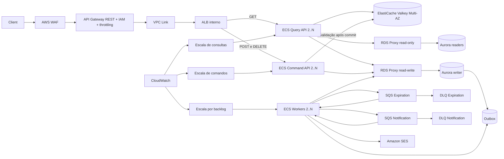

# Design da arquitetura de alta carga

**Especificação:** `.specs/features/flash-booking-high-load/spec.md`
**Depende de:** `.specs/features/flash-booking-demo/validation.md` com PASS
**Estado:** Rascunho

Esta é uma arquitetura-alvo. Nesta entrega ela será detalhada, validada estaticamente e mantida no mesmo plano de código da demo, mas seu Terraform não será aplicado nem haverá teste remoto de carga ou failover.

## Visão geral da arquitetura

O diagrama representa a mesma imagem e o mesmo binário da demo. Não há serviço Java exclusivo da alta carga. Terraform altera somente quantidade de tasks, endpoints, topologia, limites e políticas de escala.

## Caminhos de escala independentes

### Consultas

1. O mesmo cache-aside Valkey da demo atende os dois GETs com TTL máximo de um segundo.
2. `GET /events/{id}` usa o endpoint read-only do RDS Proxy em cache miss; atraso de réplica é aceitável porque disponibilidade é eventual.
3. `GET /reservations/{id}` usa o endpoint read-write para evitar `404` transitório logo após a criação.
4. O serviço escala por requisições, p95, CPU e hit rate, sem aumentar o serviço de comandos.
5. Com cache indisponível, o limite de cinco fallbacks simultâneos por task protege o PostgreSQL; excedentes recebem `503`.

### Comandos

1. Pré-escala programada prepara somente o serviço de comandos para aberturas de venda conhecidas.
2. Target tracking reage a picos inesperados dentro do máximo aceito pelo banco.
3. RDS Proxy concentra conexões, mas não aumenta a vazão da linha de inventário; o teto de tasks respeita o envelope medido.
4. A atualização condicional no Aurora mantém `available >= 0`; criar reserva e outbox ocorre na mesma transação.
5. Cancelamento e expiração incrementam estoque somente quando conquistam a transição de `PENDING` para um estado terminal.
6. Lock waits e p99 definem o limite desta arquitetura; ao atingir o limite, a borda devolve `429/503` em vez de aceitar trabalho que produziria timeout.

### Workers

1. Expiração e notificação usam filas e DLQs separadas para uma não bloquear a outra.
2. Listeners, executores, timeouts e cotas de concorrência são separados dentro de cada task; a cota de notificação não consome a reservada à expiração.
3. O serviço escala pelo maior sinal normalizado de backlog por task e idade da mensagem entre as filas, não pela profundidade bruta agregada.
4. O worker conclui mensagens em voo durante SIGTERM dentro do `stopTimeout`; redelivery continua idempotente.

## Controle de volatilidade

- Scale-out será agressivo; redução de capacidade terá cooldown maior.
- O mínimo programado sobe antes da venda e retorna após uma janela de estabilização.
- O máximo de tasks será limitado pela capacidade validada do banco.
- Controle de admissão será aplicado antes de saturar o writer.
- Cache, Aurora e compute serão habilitados e dimensionados por variáveis Terraform, sem mudança no binário Java.

## Alternativas para escala além do PostgreSQL

| Restrição observada | Alternativa | Consequência |
| --- | --- | --- |
| Confirmação síncrona obrigatória | DynamoDB com inventário particionado e escritas condicionais | Exige novo modelo e código; não é uma simples troca de infraestrutura e só pode ocorrer após nova ADR. |
| Confirmação assíncrona aceita | SQS FIFO com grupo por evento | Absorve rajadas, mas a API passa a retornar 202. |
| Muitos times e plataforma Kubernetes | EKS | Melhora padronização organizacional, não o hot row por si só. |

## Evolução por Terraform

- Reutilizar módulos da demo.
- Criar `infra/environments/high-load/` com parâmetros próprios.
- Substituir RDS por Aurora Serverless e inserir RDS Proxy.
- Evoluir Valkey para grupo de replicação Multi-AZ e habilitar múltiplas tasks e autoscaling independente.
- Criar serviços e target groups distintos para `query-api` e `command-api`, apontando para a mesma imagem imutável.
- Criar endpoints RDS Proxy read-only e read-write; somente configurações de conexão variam.
- Usar NAT por AZ e recursos Multi-AZ.
- Manter estados Terraform separados entre demo e high-load.

## Riscos e controles

| Risco | Impacto | Controle e justificativa |
| --- | --- | --- |
| Oversell em reservas concorrentes | Mais reservas aceitas que a capacidade | Decremento condicional no writer e criação da reserva na mesma transação. O cache nunca participa da decisão. Constraint impede `available < 0`. |
| Estoque inflado por cancelamento/expiração concorrentes | Ingressos podem ser vendidos duas vezes depois de uma devolução duplicada | Somente uma transição condicional saindo de `PENDING` autoriza o incremento; os demais concorrentes afetam zero linhas. Constraint também impede `available > capacity`. |
| Falha do cache | Rajada retorna ao banco e compete com comandos | Timeout de 100 ms, circuito após 5 falhas em 10 s e no máximo 5 fallbacks simultâneos por task; excesso de leitura recebe `503`, preservando comandos. |
| Cache desatualizado | Usuário vê disponibilidade antiga ou estado terminal anterior | TTL máximo de um segundo e invalidação pós-commit; o comando sempre revalida no writer, portanto inconsistência visual não vira oversell. |
| Réplica Aurora atrasada | Consulta de evento mostra valor antigo ou reserva recém-criada parece ausente | Disponibilidade aceita consistência eventual; consulta de reserva usa endpoint read-write para leitura após escrita. |
| Escala do ECS supera banco | Mais conexões e lock waits sem maior vazão | RDS Proxy controla conexões; o máximo do serviço de comandos vem do benchmark e não pode ultrapassar a capacidade validada do writer. |
| Linha quente de evento | p95/p99 de reserva cresce mesmo com mais tasks | Medir lock waits por evento, aplicar admissão e pré-escala; considerar mudança de modelo somente por nova ADR quando o SLO falhar após tuning. |
| Redução de tasks interrompe trabalho | Requisição ou mensagem em voo volta a ser processada | Drenagem do ALB, SIGTERM, `stopTimeout`, idempotência e redelivery da fila. |
| Falha de envio de e-mail | Cliente não recebe referência | Fila própria, retry, DLQ e alarme; reserva não é revertida. |
| Abuso ou credencial vazada | Custo e saturação | IAM com menor privilégio, credenciais temporárias, WAF, throttling por método, máximos Terraform e rotação/revogação da role. |
| Custo permanente | Recursos ociosos | Ambiente não é aplicado nesta entrega; futura promoção exige orçamento, janela, owner e rollback. |

## Decisões técnicas

| Decisão | Escolha | Justificativa |
| --- | --- | --- |
| Artefato | Uma imagem Java com modos `query-api`, `command-api` e `worker` | Impede divergência de regras e permite escalar deployments independentemente por configuração. |
| Escala de consultas | Serviço ECS próprio + Valkey Multi-AZ + proxy read-only para disponibilidade | Leituras têm sinal e custo distintos; cache reduz pressão e readers absorvem misses sem criar outro modelo Java. |
| Escala de comandos | Serviço ECS próprio + pré-escala + RDS Proxy read-write | Reservas crescem na abertura da venda; mais tasks só são úteis até o limite de conexão e contenção do writer. |
| Escrita autoritativa | Aurora PostgreSQL Serverless | Preserva transações, constraints, migrations e driver da demo; mudar para NoSQL exigiria regra e código novos. |
| Disponibilidade | Recursos Multi-AZ e mínimo de duas tasks por serviço | Tolera perda de task/AZ, com custo aceito somente quando a arquitetura for promovida. |
| Borda | Único API Gateway REST com IAM, WAF e throttling | Rejeita acesso e excesso antes do compute, centraliza rotas e impede endpoint alternativo sem proteção. |
| Promoção | SLO + envelope medido | TPS absoluto varia por evento e payload; nenhuma decisão de custo é executada apenas por expectativa. |

## Modelagem de dados

A arquitetura usa exatamente a [mesma modelagem da demo](../../../docs/data-model.md). Aurora não recebe tabelas, índices, migrations ou regras exclusivas. A separação entre leitura e comando é operacional: ambos consultam as mesmas entidades `Customer`, `Event` e `Reservation`; somente o endpoint de conexão e o número de tasks variam.
