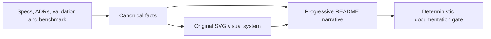

# README Visual Storytelling Design

**Spec**: `.specs/features/readme-visual-storytelling/spec.md`
**Status**: Approved

---

## Architecture Overview

O README será uma página de decisão em camadas. A primeira camada apresenta identidade, escopo, estado e execução. A segunda explica invariantes, método e evidências com visuais compactos. A terceira mantém os diagramas C4, sequência, ADRs e runbooks como aprofundamento recolhível.



No benchmark, o perfil de concorrência continuará criando duas réplicas adicionais de `command-api`, mas cada uma publicará uma porta efêmera. O runner descobrirá essas portas e fornecerá ambas explicitamente ao k6, de modo que VUs diferentes atinjam processos distintos. Isso corrige a evidência sem introduzir balanceador fictício na arquitetura do produto.

---

## Code Reuse Analysis

### Existing Components to Leverage

| Component | Location | How to Use |
| --- | --- | --- |
| Validação independente da demo | `.specs/features/flash-booking-demo/validation.md` | Fonte canônica para 43/43, 94 testes e execução AWS. |
| Baseline local | `performance/demo/README.md` e `performance/demo/results/` | Preservar números existentes até uma execução corrigida produzir nova evidência. |
| Diagramas aprofundados | `docs/images/flash-booking-c4-*.svg` e `flash-booking-sequence-reservation.svg` | Exibir dentro de seções recolhíveis, sem redesenhar o conteúdo já refinado. |
| ADRs | `docs/adr/` | Referenciar decisões e trade-offs, sem duplicar justificativas extensas. |
| Scripts de gates | `.specs/features/flash-booking-demo/tasks.md` | Reusar os comandos Maven, Compose e Terraform já comprovados. |

### Integration Points

| System | Integration Method |
| --- | --- |
| GitHub Markdown | SVGs locais, tabelas curtas, Mermaid e elementos `<details>`. |
| k6 | Variáveis `COMMAND_BASE_URLS` e `QUERY_BASE_URL`; resumo JSON por cenário. |
| Docker Compose | Portas host efêmeras descobertas a partir dos containers do perfil `concurrency`. |
| Documentation gate | PowerShell valida links locais, XML dos SVGs, estados e schema do baseline. |

---

## Components

### Truth reconciliation

- **Purpose**: Remover afirmações históricas que contradizem a validação concluída.
- **Location**: `.specs/features/flash-booking-demo/`, `.specs/REVIEW.md`, `docs/case-requirements-evaluation.md`, `docs/demo-runbook.md`.
- **Dependencies**: validação da demo, decisões ativas em `.specs/STATE.md`.
- **Reuses**: evidências já registradas; nenhuma nova alegação AWS.

### Multi-process benchmark harness

- **Purpose**: Garantir que o cenário de comandos exercite ao menos dois processos reais e gere evidência sanitizada.
- **Location**: `compose.yaml`, `performance/demo/`.
- **Interfaces**:
  - `COMMAND_BASE_URLS` - lista separada por vírgula descoberta pelo runner.
  - `run.ps1 -PublishBaseline` - executa cenários e publica o resumo canônico quando solicitado.
- **Dependencies**: Docker Compose, k6 0.48+ e a aplicação local.
- **Reuses**: três workloads k6 e o perfil `concurrency` existentes.

### Visual system

- **Purpose**: Comunicar identidade, invariante de estoque, método, evolução arquitetural e resultado de carga.
- **Location**: `docs/images/`.
- **Interfaces**: SVG 1.1 autossuficiente, com `title`, `desc`, fontes do sistema e viewBox.
- **Dependencies**: fatos canônicos; nenhum recurso web externo.
- **Reuses**: paleta azul/cinza dos C4 existentes.

### README documentation gate

- **Purpose**: Transformar as principais alegações e referências em verificações determinísticas.
- **Location**: `scripts/validate-readme.ps1`.
- **Interfaces**: saída `PASS` e código zero; mensagem específica e código não zero por violação.
- **Dependencies**: PowerShell e arquivos versionados.
- **Reuses**: convenção dos scripts de validação existentes.

---

## Data Models

### PerformanceBaseline

```text
schemaVersion, capturedAt, sourceCommit, environment
scenarios[]: name, vus, durationSeconds, requests, requestsPerSecond,
             latencyMs(p50,p95,p99), httpFailureRate
cache: hits, misses, hitRate
database: connectionsAtEnd, waitingLocksAtEnd
limitations[]
```

O arquivo é um resumo sanitizado; não contém credenciais, hosts privados ou payloads de clientes.

---

## Error Handling Strategy

| Error Scenario | Handling | User Impact |
| --- | --- | --- |
| Docker indisponível | Não substituir o baseline; registrar que a reexecução não ocorreu. | O README continua honesto e usa evidência anterior. |
| Menos de duas réplicas descobertas | Runner falha antes do k6. | Nenhuma alegação multiprocesso é publicada. |
| Threshold k6 falha | Runner falha e não publica baseline. | Evidência canônica anterior permanece. |
| Asset ausente ou SVG inválido | Gate documental falha. | Commit não é considerado concluído. |
| Baseline incompleto | Gate documental falha com o campo ausente. | Gráfico não é aceito como evidência. |

---

## Risks & Concerns

| Concern | Location | Impact | Mitigation |
| --- | --- | --- | --- |
| O benchmark inicia réplicas que não recebem tráfego | `performance/demo/run.ps1`, `compose.yaml` | A prova multiprocesso atual é inválida. | Publicar portas efêmeras, descobri-las e distribuir VUs explicitamente. |
| O snapshot de locks é coletado apenas ao final | `performance/demo/run.ps1` | Não prova ausência de contenção durante o teste. | Rotular a métrica como snapshot final e não extrapolar. |
| Cenário misto agrega latências de GET e POST | `performance/demo/mixed.js` | p95/p99 não representam uma rota isolada. | Rotular o cenário como agregado no gráfico e README. |
| README confunde entregue e planejado | `README.md` | Avaliador pode interpretar high-load como executada. | Status textual e visual explícito em todo resumo. |
| Uso de marca corporativa | `docs/images/` | Pode sugerir arte oficial. | Identidade original e disclaimer de case independente. |
| SVGs grandes no fluxo principal | `README.md` | Leitura lenta e excesso de rolagem. | Visuais compactos no fluxo e C4 detalhado em `<details>`. |

---

## Tech Decisions

| Decision | Choice | Rationale |
| --- | --- | --- |
| Estrutura editorial | Progressive disclosure | Entrega resposta rápida sem perder profundidade técnica. |
| Arte | SVG original versionado | É nítido, leve, revisável e não depende de binário gerado. |
| Evidência de carga | Resumo JSON canônico + SVG derivado | Separa dado de apresentação e permite validação automática. |
| Prova multiprocesso | Portas efêmeras explícitas | Demonstra distribuição sem adicionar infraestrutura alheia ao produto. |
| Alta carga | Sempre marcada como alvo | Respeita AD-006 e evita transformar desenho em evidência. |

Nenhuma decisão desta feature altera um padrão arquitetural do produto; por isso não há novo `AD-NNN`.
