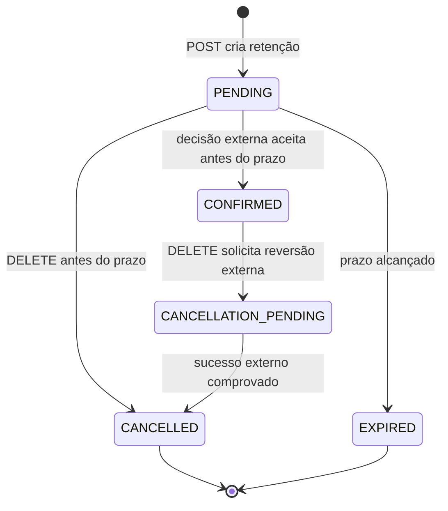

# Confirmação externa da reserva — desenho

**Spec:** `.specs/features/reservation-confirmation/spec.md`
**Status:** Implementada no runtime local. Recursos AWS declarados em Terraform ainda não aplicados.

## Veredito sobre o sistema atual

O runtime agora reserva, confirma integralmente e cancela com decisão de inventário no PostgreSQL. `ReservationCreated` e `ReservationExpirationScheduled` mantêm suas filas de notificação e expiração; `ReservationHeld`, resultados, fechamentos e pedidos de cancelamento usam uma SQS direta para o único responsável externo. A menção a “confirmação assíncrona aceita” em `flash-booking-high-load/design.md` trata do HTTP `202` da criação inicial sob carga, não do estado final `CONFIRMED`.

## Alternativas de interface

| Abordagem | Vantagem | Custo ou limite | Recomendação |
| --- | --- | --- | --- |
| Comando HTTP interno autenticado | Devolve aceite/rejeição imediatamente; reduz atraso antes do prazo. | Acopla disponibilidade e latência dos módulos; exige controle de autorização entre serviços. | Alternativa se o produtor precisar de decisão síncrona. |
| Mensagem assíncrona de confirmação + inbox | Mantém intenção durável e tolera indisponibilidade; reutiliza worker, PostgreSQL e outbox. | A mensagem pode chegar após o prazo; produtor precisa esperar resultado e compensar rejeição. | **Implementada**. |
| Webhook direto do provedor de pagamento | Parece encurtar o caminho. | Faz Flash Booking interpretar credenciais e semântica de pagamento que não lhe pertencem. | Não adotar nesta fronteira. |

## Architecture Overview

O único responsável externo trata todas as pendências e solicita a confirmação antes do prazo. Somente a role IAM desse responsável recebe `sqs:SendMessage` para a fila de entrada; essa permissão lhe concede autoridade para declarar todas as pendências resolvidas. O campo `source` da mensagem é dado autodeclarado para correlação, não autenticação. O worker bloqueia primeiro a linha da reserva, depois registra `resolutionId` na inbox e decide a transição usando o relógio PostgreSQL após o lock. Essa ordem serializa resoluções distintas para a mesma reserva antes que a FK da inbox adquira sua referência e evita deadlock de conversão de lock compartilhado em exclusivo. Inbox, reserva e resultado da outbox permanecem na mesma transação; o publisher entrega o resultado depois. O produtor não considera a reserva definitiva até receber `ReservationConfirmed`.

Há um único módulo externo responsável por **todas** as pendências. Suas réplicas competem por uma fila de trabalho; uma mensagem vai a uma réplica de cada vez, embora redelivery seja possível e exija idempotência no processamento externo. A criação grava `ReservationCreated`, `ReservationExpirationScheduled` e `ReservationHeld` na outbox da mesma transação, e o publisher encaminha cada tipo à fila correspondente. `ReservationCreated` continua interno para o consumidor de e-mail, enquanto `ReservationHeld` inicia a integração externa. Não há SNS Fan-Out.

### Filas e permissões declaradas e executadas localmente

Terraform e Compose declaram duas filas SQS Standard direcionais, cada uma com criptografia gerenciada pelo SQS, long polling de 20 segundos, visibility timeout configurável (60 segundos por padrão) e DLQ própria. `reservation-to-owner` carrega `ReservationHeld`, resultados e solicitações de cancelamento para o módulo externo; `reservation-from-owner` recebe confirmação e conclusão correlacionada de cancelamento. As filas existentes de notificação e expiração mantêm suas finalidades.

No worker, a role da task publica somente em `reservation-to-owner` e consome somente `reservation-from-owner`, além das permissões atuais das filas internas. A variável opcional `reservation_owner_role_arn` instala uma resource policy que permite à role configurada consumir a fila de saída e publicar na fila de entrada. Ausência da configuração não concede acesso externo; outputs expõem ambas as URLs ao responsável. Para integração cross-account, a role externa também precisa de uma identity policy correspondente na própria conta. Os alarmes e dashboard da demo incluem backlog, idade e mensagens em DLQs dessas duas filas.

O ambiente local cria as mesmas quatro filas com LocalStack e fornece as URLs ao worker. O teste de integração simula o responsável externo nessas filas; não existe implementação de compra ou pagamento. A infraestrutura AWS está em Terraform e não foi aplicada.

## Filas de trabalho e fan-out

| Papel | SQS direta | SNS com assinaturas SQS | Recomendação |
| --- | --- | --- | --- |
| Entrada `ReservationConfirmationRequested` e desfecho de cancelamento | Uma fila tem um dono lógico (Flash Booking), mas vários workers podem competir por mensagens. | Cada fila assinante recebe sua cópia, permitindo múltiplos processadores do mesmo comando. | **SQS direta**, pois só Flash Booking decide o estado da reserva. |
| `ReservationHeld` para iniciar todas as pendências | Uma fila para o único módulo responsável permite várias réplicas sem distribuir a mesma tarefa a módulos diferentes; a operação externa ainda exige idempotência. | Fan-out dá uma cópia da mesma pendência a cada assinante, podendo duplicar a operação de negócio. | **SQS direta do responsável externo**, recomendada após revisão da outbox atual; o módulo é simulado nos testes, não implementado aqui. |
| Resultado e pedido de cancelamento ao módulo externo | A mesma fila dirigida ao único responsável pode transportar tipos de mensagem distintos; o consumidor os distingue por contrato. | Fan-out só agrega valor se houver vários consumidores independentes com necessidades concretas. | **A mesma SQS direta do responsável externo**; não implantar SNS agora. |

Vários eventos de venda não exigem uma fila por `eventId`: a fila recebe mensagens de todos, e vários workers processam reservas diferentes em paralelo, inclusive reservas do mesmo evento. A confirmação bloqueia a linha da reserva, sem novo débito de `event.available`; a concorrência relevante com expiração e cancelamento é resolvida no PostgreSQL. Uma fila SQS Standard tolera reordenação/duplicidade; inbox, transição condicional e outbox tornam a decisão idempotente. A fila não impede que o produtor externo cobre duas vezes se ele não tiver sua própria chave idempotente. Se surgir requisito de ordem estrita para mensagens da mesma **reserva**, avaliar FIFO com `MessageGroupId=reservationId`, permitindo paralelismo entre reservas. Agrupar por `eventId` serializaria todas as reservas da flash sale e criaria um gargalo. Mesmo FIFO pode entregar outra vez após sua janela de deduplicação ou expiração da visibilidade; a proteção de negócio precisa ser durável. SNS fica como opção futura quando houver múltiplos consumidores independentes.

O payload correto não comprova a identidade nem a resolução das pendências. A integração confia na role IAM do único responsável para atestar o conjunto inteiro; Flash Booking só comprova sua decisão de estoque e prazo.

### Por que uma mensagem antes do prazo pode ser rejeitada

Exemplo: `expiresAt=12:00:00`. O produtor publica `ReservationConfirmationRequested` às `11:59:59`, mas a fila entrega às `12:00:01`. Às `12:00:00`, a reserva deixa de ser válida; o reconciliador pode liberar os ingressos, e outra reserva pode retê-los. Confirmar retroativamente pela hora declarada no payload poderia comprometer os mesmos ingressos duas vezes. Por isso o Flash Booking bloqueia a reserva e usa o horário PostgreSQL da **decisão**. Se ainda estiver `PENDING`, o consumidor materializa `EXPIRED`, devolve a capacidade e grava `ReservationHoldClosed(EXPIRED)` atomicamente; depois responde `EXPIRED`. Se outro fluxo já a expirou, a confirmação só grava e entrega a rejeição. O módulo externo aguarda esse resultado e resolve sua própria consequência.

## Máquina de estados e inventário

| Transição | Efeito no estoque | Resultado externo |
| --- | --- | --- |
| Criação → `PENDING` | `available -= quantity` | Reserva temporária criada. |
| `PENDING → CONFIRMED` | Nenhum; estoque já está retido. | `ReservationConfirmed`. |
| `PENDING → CANCELLED` ou `EXPIRED` | `available += quantity` uma vez. | `ReservationHoldClosed(CANCELLED/EXPIRED)` ao responsável externo; uma confirmação posterior recebe `ReservationConfirmationRejected`. |
| `CONFIRMED → CANCELLATION_PENDING` | Nenhum; o estoque segue comprometido. | `ReservationCancellationRequested` com `cancellationId` pela outbox. |
| `CANCELLATION_PENDING → CANCELLED` | `available += quantity` uma vez, após `ReservationCancellationCompleted` corresponder ao `cancellationId`. | A mensagem de sucesso é consumida e deduplicada na inbox. |
| Confirmação após `CONFIRMED` | Nenhum. | Mesma mensagem reproduz resultado; mensagem distinta não confirma novamente. |

Invariante por evento: `capacity - available = SUM(quantity WHERE status IN ('PENDING','CONFIRMED','CANCELLATION_PENDING'))`. Uma reserva `CONFIRMED` não tem motivo de encerramento; `confirmedAt` fica presente também durante e depois do cancelamento pendente para preservar o histórico da confirmação. Expiração só atua sobre `PENDING` e ignora `CONFIRMED` e `CANCELLATION_PENDING`. `DELETE` em `PENDING` mantém o encerramento imediato existente. `DELETE` em `CONFIRMED` grava `CANCELLATION_PENDING` e responde `202` sem afirmar conclusão; repetir o pedido mantém `202` sem nova solicitação. Depois de entrar em `CANCELLATION_PENDING`, a reserva não retorna a `CONFIRMED`. Falha ou ausência de resposta externa conserva esse estado e o estoque até chegada do desfecho positivo.

## Contrato de integração implementado

- Início do fluxo externo: gravar `ReservationHeld` na outbox junto da criação e publicá-lo em uma SQS direta do único módulo responsável por todas as pendências. O payload v1 contém `outboxEventId`, `type`, `reservationId`, `eventId`, `quantity` e `expiresAt`, sem dados pessoais ou financeiros; `outboxEventId` é igual à chave primária da outbox e estável em republicações. O evento interno atual `ReservationCreated` alimenta a fila de notificação por e-mail e seu payload inclui `customerId`; não o expor diretamente como contrato público. Não usar SNS para esse trabalho.
- Entrada: `ReservationConfirmationRequested` versão 1, como objeto JSON com exatamente `version`, `type`, `source`, `resolutionId`, `reservationId` e `requestedAt`; `ReservationCancellationCompleted` versão 1 usa os mesmos campos comuns, substitui `requestedAt` por `cancellationId`. Tipos, UUIDs, `Instant`, identificadores e campos são validados; campos extras/desconhecidos ou payload acima de 16 KiB UTF-8 são inválidos e seguem retry/DLQ sem tocar a reserva. O `messageId` nativo do SQS é apenas transporte e não integra a identidade de negócio. `requestedAt` serve para auditoria, nunca para substituir o relógio da decisão. O responsável só envia confirmação depois de resolver todas as pendências.
- Origem: somente a role IAM do único responsável externo publica na fila de entrada e atesta todas as pendências. `source` é identificador contratual autodeclarado, não prova de identidade. Payload tem limite e validação. Não receber webhook bruto de pagamento.
- Deduplicação de entrada: chave única `(source, resolutionId)` na inbox, com SHA-256 dos campos de contrato validados em representação canônica, resultado e instante para replay; whitespace, ordem de propriedades JSON e `messageId` de transporte não afetam o fingerprint. A reserva só pode aceitar uma resolução externa, e uma chave repetida com valores semanticamente diferentes é conflito e permanece elegível a retry/DLQ. O mesmo `resolutionId` reentregue reproduz o resultado, sem nova confirmação.
- Saída da confirmação: `ReservationConfirmed` ou `ReservationConfirmationRejected`, versão 1, com `outboxEventId`, `resolutionId`, `reservationId`, código de resultado, estado decidido quando houver e instante de decisão; nenhuma PII ou dado financeiro. `outboxEventId` é também o identificador estável de republicação. A rejeição obriga o solicitante a avaliar e executar compensação de uma operação externa já concluída; Flash Booking não sabe se há valor a estornar nem acompanha a conclusão da compensação.
- Cancelamento de confirmado: `DELETE` cria `cancellationId`, registra `CANCELLATION_PENDING` e `ReservationCancellationRequested` na outbox transacional. O publisher envia a solicitação à fila do módulo externo responsável. Esse módulo devolve `ReservationCancellationCompleted` com o mesmo `cancellationId` somente depois de resolver todas as obrigações. A mensagem correlacionada e deduplicada permite `CANCELLED` e devolução única de estoque. Sem conclusão positiva, Flash Booking mantém o estado e a capacidade.
- Fechamento de pendente: `DELETE` antes do prazo conclui `CANCELLED`; em `expiresAt` ou depois, `DELETE`, consumidor ou reconciliador podem concluir `EXPIRED`. Somente o vencedor devolve estoque e grava `ReservationHoldClosed` v1 (com `outboxEventId`, `reservationId`, `eventId`, `quantity` e estado terminal) na mesma transação para o responsável externo. `ReservationExpirationScheduled` apenas dispara a tentativa; não é o fato de fechamento. O fechamento pode chegar antes ou depois de `ReservationHeld`; o módulo externo precisa tratar ambas as ordens e compensar uma operação já concluída. Flash Booking não acompanha a compensação.
- Rejeições de domínio: `NOT_FOUND`, `EXPIRED`, `CANCELLED`, `ALREADY_CONFIRMED`, `INVALID_REQUEST`. Falha técnica deixa a mensagem elegível a retry/DLQ, sem fabricar rejeição de negócio.
- Regra temporal: o instante PostgreSQL observado depois do lock decide a aceitação. Mensagem atrasada pode ser rejeitada mesmo se produzida antes do prazo; cabe ao produtor tratar compensação após a resposta.

### Idempotência entre sistemas

O evento `ReservationHeld` conserva o mesmo `outboxEventId` em cada tentativa de publicação. A outbox atual pode republicar depois de enviar à SQS e antes de gravar `published_at`, inclusive em mais de uma instância do publisher; por isso a fila não é promessa de exatamente uma execução. O contrato do único responsável externo exige uma identidade durável por reserva e operação (`reservationId` + tipo), registro de processamento e a mesma chave de idempotência em sua operação externa. Se a operação externa envolver pagamento, a chave precisa acompanhar a chamada ao provedor; Flash Booking não pode garantir isso sozinho. O responsável só envia `ReservationConfirmationRequested` após resolver **todas** as pendências, com `resolutionId` estável em retries. A inbox do Flash Booking e a transição condicional impedem que redelivery confirme duas vezes ou altere estoque novamente.

## Code Reuse Analysis

| Artefato atual | Reuso ou mudança planejada |
| --- | --- |
| `reservation/application/*` | Aplicar a decisão de transição em serviços do ciclo de reserva com interface pequena para o consumidor. |
| `JdbcReservationPersistenceAdapter` | Usar `FOR UPDATE` e tempo PostgreSQL pós-lock; transições condicionais e leitura de resultado estão implementadas. |
| `outbox_event` e publisher | V7 aceita eventos de integração. `ReservationHeld`, resultados, `ReservationHoldClosed` e `ReservationCancellationRequested` são gravados com o estado/inbox e roteados ao SQS do responsável sem reutilizar filas de notificação/expiração. |
| `ExpirationReconciler`, `SqsExpirationConsumer` e `DELETE` tardio | Somente o vencedor de `PENDING → EXPIRED` devolve capacidade e grava `ReservationHoldClosed(EXPIRED)` na mesma transação. |
| `GET /reservations/{id}` | Expõe `CONFIRMED`/`confirmedAt` sem dados de pagamento. |
| `docs/images/flash-booking-c4-*.svg` | Convenções visuais aplicadas às vistas atuais e aos limites de deployment. |

## Data Models

- `reservation.status` inclui `CONFIRMED` e `CANCELLATION_PENDING`; `confirmed_at TIMESTAMPTZ` e `cancellation_id UUID` são nullable, com coerência por status. `confirmed_at` é nulo antes da confirmação e obrigatório em `CONFIRMED`, `CANCELLATION_PENDING` e no `CANCELLED` vindo de reserva confirmada. `cancellation_id` é obrigatório em `CANCELLATION_PENDING`, único enquanto não nulo e permanece no `CANCELLED` originado dele; é nulo nos outros estados. Motivos terminais continuam identificando cancelamento solicitado ou prazo alcançado.
- `confirmation_inbox`: `source` e `resolution_id` são texto não vazio de até 128 caracteres e formam a chave primária de deduplicação; `reservation_id` nullable permite armazenar `NOT_FOUND` e referencia a reserva com exclusão restrita quando ela existe. `message_type` só aceita confirmação solicitada ou conclusão de cancelamento; o fingerprint é SHA-256 hexadecimal minúsculo de 64 caracteres; `outcome` é um objeto JSON reproduzível, `processed_at` usa o relógio PostgreSQL e `cancellation_id` é obrigatório somente para conclusão de cancelamento. Não há índice secundário até existir uma consulta medida que o justifique.
- A inbox conserva o resultado enquanto a reserva existir nesta versão. Limpeza ou arquivamento posterior exige janela de redrive definida para não perder a semântica de replay.
- `outbox_event`: novos tipos de resultado e solicitação de cancelamento com payload versionado. Publicação segue o padrão transacional existente.
- Inventário: manter a atualização condicional em PostgreSQL; não decrementar outra vez ao confirmar.

## Representações visuais no README

| Vista | Pergunta que responde | Artefato atual |
| --- | --- | --- |
| C4 System Context | Quem solicita confirmação e cancelamento e qual sistema decide/compensa? | `docs/images/flash-booking-confirmation-c4-context.svg` |
| C4 Container | Onde estão APIs, worker, PostgreSQL, outbox e as duas filas direcionais da integração, sem SNS? | `docs/images/flash-booking-confirmation-c4-containers.svg` |
| Componentes AWS | Quais recursos Terraform conectam criação, banco, worker, filas com DLQ e responsável externo, sem detalhar a implementação desse responsável? Como uma reserva percorre essa topologia até o resultado? | `docs/images/flash-booking-confirmation-aws-components.svg`, com sequência 01–08 e ramos de encerramento/cancelamento |
| Dinâmica/estado | O que acontece com aceite, duplicata, atraso, expiração e cancelamento pendente? | `docs/images/flash-booking-confirmation-lifecycle.svg` |

As vistas C4 seguem níveis distintos: contexto mostra pessoas e sistemas; containers mostram processos e armazenamentos dentro do Flash Booking e as duas SQS fora do limite do software, com dono lógico identificado. A vista AWS mostra os recursos declarados em Terraform e mantém opaca a implementação externa; ela não detalha autenticação. O diagrama de estados mostra desfechos e corridas. O README mantém os cinco endpoints. As vistas descrevem o ciclo executável local e identificam que os recursos de confirmação AWS ainda não foram aplicados; nenhuma afirma pagamento realizado. Na vista de dados, a inbox reconhece uma reentrega idêntica de `source + resolutionId` com o mesmo fingerprint e reapresenta o resultado anterior; ela não deduplica a operação externa nem substitui a decisão de estado sob lock.

## Error Handling Strategy

| Cenário | Resultado |
| --- | --- |
| Mensagem duplicada | Reproduzir decisão da inbox, sem novo efeito. |
| Mensagem após prazo ou após encerramento | Rejeição de negócio correlacionada; nenhuma confirmação retroativa. |
| Operação externa concluída mas confirmação rejeitada | Resultado correlacionado ao solicitante; ele avalia e executa compensação sob seu próprio controle. Não há segunda transição da reserva já expirada nem acompanhamento da compensação no Flash Booking. |
| Cancelamento externo falho, recusado ou sem resposta | Manter `CANCELLATION_PENDING` e estoque comprometido; retry/alerta operacional até conclusão positiva, sem presumir reversão nem permitir desfazer o pedido. |
| Banco indisponível | Retry da mensagem; nenhuma confirmação afirmada. |
| Falha de envio da resposta | Outbox pendente e retry; produtor permanece aguardando. |
| Falhas reiteradas no consumo | DLQ e alarme operacional, com procedimento de redrive. |

## Risks & Concerns

| Concern | Evidência atual | Impacto | Mitigação |
| --- | --- | --- | --- |
| Estados e constraints precisam permanecer alinhados | V1 e V6, `.specs/STATE.md` AD-031 | Uma migração ou transição incorreta poderia liberar estoque já confirmado. | Constraints, migration e testes cobrem cada estado e cada devolução. |
| Expiração e `DELETE` afetam estados diferentes | `JdbcReservationPersistenceAdapter.java` e testes PostgreSQL | Uma atualização não condicional poderia devolver estoque confirmado. | Transições condicionais e testes de corrida contra PostgreSQL real. |
| O prazo é calculado antes da espera pelo lock de estoque | `CreateReservationService.java:43-55` | Reduz a janela efetiva para confirmação sob contenção. | Medir o prazo na decisão de criação e testar lock wait na mesma mudança. |
| Mensagem externa pode chegar tarde | Nova fronteira assíncrona | O produtor pode ter concluído sua própria operação sem reserva. | Resultado explícito e contrato de compensação; não presumir sucesso pela publicação. |
| Cancelamento de confirmado depende de responsável externo | Fronteira assíncrona | `CANCELLATION_PENDING` pode durar indefinidamente e reter estoque. | Não liberar estoque sem `ReservationCancellationCompleted`; fila e consumidor mantêm retry/DLQ e o módulo externo controla sua recuperação. |
| Inbox cresce com mensagens processadas | Novo armazenamento durável | Custo e retenção sem limite explícito. | Medir volume e definir arquivo/limpeza somente depois de fixar a janela de redrive. |
| Publisher atual pode reenviar o mesmo evento | `OutboxSqsPublisher` publica antes de marcar `published_at` e várias instâncias leem pendências | Um `ReservationHeld` duplicado pode iniciar a mesma operação externa mais de uma vez. | Identidade estável do evento, deduplicação durável por reserva/operação no responsável externo e chave idempotente no provedor. |
| `ReservationHoldClosed` pode chegar antes de `ReservationHeld` | SQS Standard e publicação assíncrona | Responsável externo poderia iniciar trabalho em reserva já cancelada ou expirada. | Tratar fechamento como estado terminal/tombstone por reserva e descartar hold tardio; teste com ordem invertida para ambos os motivos. |
| Diagramas C4 antigos combinam topologia e componentes da demo | `docs/images/flash-booking-c4-demo.svg`, `README.md` | O leitor pode confundir cenários de infraestrutura com o ciclo de reserva. | Vistas C4 por nível e reconciliação das figuras antigas com o runtime, identificando demo e topologia de alta carga. |
| Specs derivadas assumem apenas três estados | `flash-booking-demo`, `dynamic-fake-load`, `event-executive-summary` | Invariantes, métricas e relatórios ficariam falsos. | Atualizar todas as specs afetadas junto da implementação, inclusive critérios e testes. |

## Tech Decisions

| Decisão | Contrato | Razão |
| --- | --- | --- |
| Nome do estado | `CONFIRMED` | Representa compromisso de reserva sem interpretar pagamento. |
| Entrada e saída | Inbox para mensagem externa, outbox para resultado | Protege duplicatas e dual write. |
| Cancelamento de confirmado | Pedido sem reversão a `CONFIRMED`, com `CANCELLATION_PENDING` + outbox para fila externa | Não afirma reversão financeira nem libera capacidade antes do desfecho positivo. |
| Fechamento de pendente | `ReservationHoldClosed(CANCELLED/EXPIRED)` gravado na transição vencedora | Avisa o único responsável externo sem acompanhar sua compensação. |
| Fan-out | Adiado até existir mais de um consumidor independente | Evita um tópico sem assinantes e não duplica uma pendência externa. |
| Autoridade temporal | PostgreSQL após lock | Mantém a mesma regra de prazo sob concorrência. |
| Fonte dos visuais | `.specs/` e código verificado | README apresenta a arquitetura sem se tornar outra fonte de regra. |

## Referências de desenho

- [C4 Model — diagramas](https://c4model.com/diagrams): contexto, containers e diagramas dinâmicos têm escopos distintos; não é necessário desenhar todos os níveis.
- [AWS — transactional outbox](https://docs.aws.amazon.com/prescriptive-guidance/latest/cloud-design-patterns/transactional-outbox.html): publicação pode duplicar eventos; o consumidor precisa ser idempotente.
- [AWS — SNS com filas SQS assinantes](https://docs.aws.amazon.com/sns/latest/dg/sns-sqs-as-subscriber.html): um tópico envia cópias para filas independentes.
- [AWS — tipos de fila SQS](https://docs.aws.amazon.com/AWSSimpleQueueService/latest/SQSDeveloperGuide/sqs-queue-types.html): Standard pode duplicar e reordenar; FIFO introduz grupos ordenados.
- [AWS — paralelismo por grupo FIFO](https://docs.aws.amazon.com/AWSSimpleQueueService/latest/SQSDeveloperGuide/FIFO-queues-understanding-logic.html): mensagens de grupos diferentes podem progredir em paralelo.

## Specs afetadas na execução

Atualizar `STATE.md`/AD-007, `CONTEXT.md`, `flash-booking-demo/{spec,context,design}`, `flash-booking-high-load/{spec,context,design,tasks}`, `dynamic-fake-load/spec`, `event-executive-summary/{spec,context,design}`, `eventual-consistency-aws-visuals/{spec,design}` e `readme-visual-storytelling/{spec,design}`. Revisar também Postman, notificações, diagramas existentes e o gate de README. Artefatos de validação anteriores preservam o escopo que efetivamente validaram.
