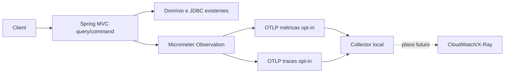

# Spring Boot 4 e observabilidade — desenho

**Spec:** `.specs/features/spring-boot-4-observability/spec.md`
**Status:** Aprovado para execução local pelo pedido “pode implementar”.

## Abordagem

O mesmo monólito modular e os três modos de processo continuam. A migração é sequencial: Boot 3.5.0 → última 3.5.x → Boot 4.0.8. Não se alteram schema, contrato HTTP, regras de negócio nem Terraform aplicado. O código passa a usar Jackson 3, evitando a ponte Jackson 2 depreciada. Os starters Boot 4 são explícitos por tecnologia, inclusive Flyway e testes MVC/JDBC/Redis. A instrumentação usa o starter oficial OpenTelemetry do Spring Boot 4 e configura exportadores OTLP desligados por padrão.

### Alternativas avaliadas

| Opção | Vantagem | Custo/risco | Decisão |
| --- | --- | --- | --- |
| Starter Boot 4 + Jackson 3 | Integração suportada e sem camada JSON legada | Adaptação de imports e APIs; testes de contrato obrigatórios | Escolhida |
| Starter Boot 4 + `spring-boot-jackson2` | Menos alterações imediatas | Módulo depreciado, futura segunda migração e possível divergência de mappers | Reserva se incompatibilidade objetiva bloquear |
| Java agent ADOT na aplicação local | Auto-instrumentação ampla | Outra distribuição e configuração; maior risco de duplicar spans com Micrometer | Não escolhida nesta entrega |

## Fluxo de telemetria

Apenas spans e métricas HTTP são garantidos nesta entrega. `X-Correlation-ID` permanece independente do trace ID. Outbox e SQS não propagam contexto distribuído automaticamente. Os logs seguem stdout; nenhum exportador OTLP de logs é incluído. O Actuator expõe apenas `health`, como hoje.

## Componentes e interfaces

| Componente | Local | Responsabilidade |
| --- | --- | --- |
| POM Maven | `pom.xml` | Boot 4.0.8, starters focados, Jackson 3, testes correspondentes, AWS SDK BOM preservado |
| Mapeamento JSON | `src/main/java`, `src/test/java` | Migrar uso de `ObjectMapper`, `JsonNode` e exceções para Jackson 3 sem alterar payloads |
| Configuração padrão | `src/main/resources/application.yml` | Desligar exportação de métricas, traces e logs OTLP; preservar health |
| Configuração local | `src/main/resources/application-observability.yml` | Endpoint OTLP explícito e sampling local para demonstração |
| Coletor local | `compose.yaml` e arquivo de configuração dedicado | Receber OTLP sem enviar dados à AWS; execução por profile opt-in |
| Plano AWS | `.specs/features/spring-boot-4-observability/` | Descrever sidecar/agent, IAM, destinos, custo, rollout e rollback; sem Terraform aplicado |
| Documentação visual | `README.md`, `docs/`, `.specs/` | Atualizar versão do runtime e diferenciar diagrama atual de demo histórica |

## Compatibilidade e falhas

| Situação | Resposta |
| --- | --- |
| Collector ausente com exportação desabilitada | Nenhuma tentativa OTLP; aplicação mantém comportamento atual |
| Collector indisponível com exportação habilitada | Exportadores descartam/retry de telemetria; a resposta HTTP e transação de reserva não dependem dele |
| Serialização JSON diferente | Os testes existentes de controller, idempotência, fila e cache devem falhar; corrigir código, nunca enfraquecer testes |
| Falha de um modo `query-api`, `command-api` ou `worker` | Corrigir wiring específico antes de declarar a migração validada |

## Riscos e mitigação

| Risco | Evidência | Mitigação |
| --- | --- | --- |
| Jackson 2 usado em produção e testes | `rg com.fasterxml src` encontrou controllers, cache, persistência, SQS e ITs | Migrar todos os usos, comparar JSON nas integrações |
| Boot 4 modular altera pacotes de teste e auto-configuração | `@WebMvcTest`, `@AutoConfigureMockMvc`, `RedisProperties`, `TaskSchedulingAutoConfiguration` aparecem nos testes | Ajustar imports e starters pelo guia oficial, compilar testes antes da suíte |
| Flyway só depende de `flyway-core` no POM atual | `pom.xml` | Usar `spring-boot-starter-flyway` e manter suporte PostgreSQL |
| Múltiplos perfis na mesma imagem | AD-016, Compose e ECS | Validar inicialização dos três modos |
| Telemetria pode vazar dados ou gerar alto custo | IDs e e-mail transitam pelos comandos | Sem tags personalizadas de alta cardinalidade; sampling e controles de retenção no plano AWS |
| Documento visual high-load nomeia Boot 3 | `docs/images/flash-booking-c4-high-load.svg` | Corrigir SVG; não adulterar imagens da demo AWS historicamente provisionada |

## Decisões de projeto

- AD-002 será supersedida por nova decisão Boot 4 somente depois de gates verdes.
- AD-023 e AD-024 continuam descrevendo os dashboards já implantados; o plano OTLP não reescreve essa evidência.
- A integração AWS é opcional e exige autorização separada para Terraform/deploy. O plano compara CloudWatch agent sidecar com ADOT collector e define uma escolha antes da implantação, sem presumir que o SDK nativo já equivale ao auto-agent de Application Signals.

## Fontes oficiais

- [Guia de migração Boot 4](https://github.com/spring-projects/spring-boot/wiki/Spring-Boot-4.0-Migration-Guide)
- [Requisitos Boot 4.0.8](https://docs.spring.io/spring-boot/4.0/system-requirements.html)
- [Observabilidade Boot 4](https://docs.spring.io/spring-boot/4.0/reference/actuator/observability.html)
- [CloudWatch OTLP](https://docs.aws.amazon.com/AmazonCloudWatch/latest/monitoring/CloudWatch-OTLPGettingStarted.html)
- [Application Signals em ECS](https://docs.aws.amazon.com/AmazonCloudWatch/latest/monitoring/CloudWatch-Application-Signals-Enable-ECSMain.html)
