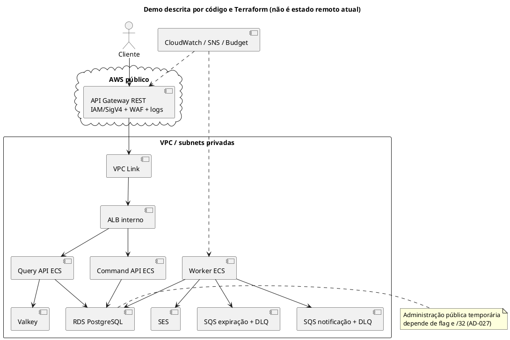

# Revisão AWS Well-Architected quick — Flash Booking

> **Classificação: CONFIDENCIAL** — Contém lacunas de segurança e resiliência. Compartilhar somente com pessoas autorizadas. Este documento não contém credenciais, endereços reais nem estado Terraform.

## Escopo e método

Revisão de perguntas, não de cada best practice (BP), da **demo descrita pelo Terraform e por validações históricas** e da **arquitetura high-load apenas documentada**. O código não prova que a demo continua provisionada ou que uma configuração remota ainda corresponde ao repositório. A high-load não tem diretório Terraform nem teste remoto nesta versão (AD-006). Não houve consulta à conta AWS, `plan`, `apply`, teste de carga remoto ou alteração de infraestrutura.

Fonte canônica congelada: [índice oficial AWS Well-Architected](https://docs.aws.amazon.com/wellarchitected/latest/framework/toc-contents.json), obtido em **2026-09-27 19:33:12 UTC** pelo script `scripts/build-wa-corpus.ps1`. O manifesto temporário passou com `valid: true`: **6 pilares, 57 perguntas, 306 BPs**, sem referências órfãs ou duplicatas. A revisão cobre **57/57 perguntas**; não declara avaliação de 306/306 BPs. Perguntas por pilar: custo 11, operações 11, desempenho 5, confiabilidade 13, segurança 11, sustentabilidade 6. O índice usa um URL opaco para `SUS01`; a identificação foi extraída do título canônico, e o BP `SUS01-BP01` foi validado contra a pergunta.

Status por célula: `atendido no escopo analisado` significa que a evidência citada sustenta **somente o aspecto indicado**, não a pergunta inteira; `risco aceito` exige AD explícita; `remediação proposta` registra uma lacuna ou controle ainda não entregue; `evidência insuficiente` indica a prova ausente; `não aplicável` exige justificativa. Nenhum status significa certificação AWS. As linhas usam estes atalhos de fonte, sempre com número de linha:

| Atalho | Arquivo |
| --- | --- |
| `S` | `.specs/STATE.md` |
| `HD` | `.specs/features/flash-booking-high-load/design.md` |
| `HS` | `.specs/features/flash-booking-high-load/spec.md` |
| `DV` | `.specs/features/flash-booking-demo/validation.md` |
| `DL` | `.specs/features/dynamic-fake-load/spec.md` |
| `E` | `infra/environments/demo/main.tf` |
| `EV` | `infra/environments/demo/variables.tf` |
| `N` | `infra/modules/network/main.tf` |
| `D` | `infra/modules/data-plane/main.tf` |
| `C` | `infra/modules/compute/main.tf` |
| `G` | `infra/modules/edge-observability/main.tf` |
| `CI` | `.github/workflows/ci.yml` |
| `CR` | `src/main/java/com/cielo/flashbooking/reservation/application/CreateReservationService.java` |
| `JR` | `src/main/java/com/cielo/flashbooking/adapter/out/persistence/reservation/JdbcReservationPersistenceAdapter.java` |
| `GE` | `src/main/java/com/cielo/flashbooking/event/application/GetEventService.java` |

Por exemplo, `D:28-33` equivale a `infra/modules/data-plane/main.tf:28-33`. A ausência de recurso IaC é uma **lacuna do repositório**, não prova de ausência na conta. Para confirmá-la, é preciso inventário read-only da conta e configuração efetiva; para medir comportamento, métricas e testes remotos autorizados.

## Arquitetura descoberta

`E:28-91` compõe rede, dados, compute e borda; `G:250-285` autentica os cinco métodos; `C:202-419` separa três serviços da mesma imagem; `D:15-121` define RDS, Valkey, filas, DLQs e SES. A aplicação tem controllers HTTP, comandos JDBC transacionais que gravam reserva e outbox (`CR:35-58`, `JR:117-130`), consumidor assíncrono, idempotência PostgreSQL e fallback limitado de cache (`GE:27-75`). A borda autentica via IAM, não por Spring Security (`S`, AD-014). A arquitetura high-load propõe Aurora, RDS Proxy, Valkey Multi-AZ, pelo menos duas tasks por serviço e claim/lease da outbox (`HD:7`, `HD:20-39`, `HD:64-86`, `HD:107-114`); nada disso foi considerado implantado.

## Avaliação das 57 perguntas

Cada síntese abaixo limita o alcance da classificação. `risco aceito` aponta a decisão na própria linha. Para `evidência insuficiente`, a síntese informa o dado faltante ou a seção de próximos passos explica sua coleta. URLs e títulos das perguntas permanecem no inventário AWS congelado; IDs são canônicos.

### Otimização de custos (11/11)

| Pergunta | Demo | High-load | Evidência, limite ou ação |
| --- | --- | --- | --- |
| COST01 | remediação proposta | evidência insuficiente | Budget existe (`G:482-502`), mas AD-017 em `S` fixa US$5 e Terraform usa US$50; resolver a divergência antes de afirmar governança. High-load exige orçamento aprovado (`HD:107-114`). |
| COST02 | atendido no escopo analisado | evidência insuficiente | Corte automático é delimitado a recursos recuperáveis (`G:523-616`; `S`, AD-026); confirmar custo residual e autorização de retomada no inventário remoto. |
| COST03 | atendido no escopo analisado | evidência insuficiente | Budget, três avisos e dashboard configurados (`G:482-502`, `G:672-674`); falta série de gasto e recebimento recente dos alertas. |
| COST04 | remediação proposta | evidência insuficiente | Runbook histórico direciona destroy (`DV:66-67`), mas não há prova atual de inventário zero nem de política de retenção de dados. |
| COST05 | remediação proposta | remediação proposta | Serviços da demo estão selecionados (`D:15-74`, `C:202-419`); decisão Aurora/Proxy da high-load ainda depende de custo medido (`HD:107-114`, `HD:146`). |
| COST06 | atendido no escopo analisado | remediação proposta | RDS pequeno e ECS com limites fixos/escaláveis (`D:23`, `C:338-338`, `C:419-463`); high-load carece de envelope medido (`HD:64`, `HD:146`). |
| COST07 | evidência insuficiente | evidência insuficiente | Escolha de Fargate está registrada (`S`, AD-004), mas não há comparação de modelos de preço ou compromisso de uso nos arquivos analisados. |
| COST08 | remediação proposta | remediação proposta | NAT único e saída HTTPS das tasks (`N:73-93`, `N:199-205`); estimar tráfego/NAT/endpoints por AZ antes da promoção (`HD:113`). |
| COST09 | atendido no escopo analisado | remediação proposta | CPU target tracking para duas APIs (`C:419-463`), worker fixo (`C:398-413`); backlog scaling high-load é futuro (`HS:12-13`). |
| COST10 | evidência insuficiente | evidência insuficiente | `S`, AD-009 justifica RDS/Aurora, mas não há cadência ou benchmark comparativo de novos serviços. |
| COST11 | evidência insuficiente | evidência insuficiente | `S`, AD-004 considera carga operacional de EKS; não há custo de esforço quantificado para demo ou high-load. |

### Excelência operacional (11/11)

| Pergunta | Demo | High-load | Evidência, limite ou ação |
| --- | --- | --- | --- |
| OPS01 | atendido no escopo analisado | evidência insuficiente | Prioridades de demo e teto de custo explícitos (`S`, AD-006/AD-026); faltam prioridades operacionais da promoção. |
| OPS02 | evidência insuficiente | evidência insuficiente | `S`, AD-002 presume operação individual; ownership, plantão e escalonamento não são comprovados por código. |
| OPS03 | evidência insuficiente | evidência insuficiente | `S`, AD-002 não comprova cultura, revisão pós-incidente ou rotinas de equipe. |
| OPS04 | atendido no escopo analisado | remediação proposta | Logs e dashboards configurados (`C:75-89`, `G:353-355`, `G:672-674`); high-load precisa métricas por modo e sinais de outbox/locks (`HS:109-111`). |
| OPS05 | atendido no escopo analisado | evidência insuficiente | CI executa Java/integrations e testes Terraform (`CI:22-54`); não há prova de fluxo de correção em produção. |
| OPS06 | atendido no escopo analisado | remediação proposta | ECS circuit breaker (`C:342-346`, `C:374-378`, `C:405-409`); high-load exige ensaio de rollout e rollback (`HD:7`). |
| OPS07 | remediação proposta | remediação proposta | Validações remotas são datadas (`DV:54-67`); falta readiness atual e high-load não tem deploy (`HD:7`). |
| OPS08 | evidência insuficiente | evidência insuficiente | Dashboards (`G:672-674`, `G:995-997`) não mostram uso organizacional, alert triage ou review periódico. |
| OPS09 | atendido no escopo analisado | evidência insuficiente | Alarmes API, target, banco, filas e worker (`G:619-671`, `D:127-180`, `C:469-480`); falta telemetria recente e SLO efetivo. |
| OPS10 | remediação proposta | evidência insuficiente | SNS recebe alarmes (`E:14-25`); confirmar entrega, rota de incidente e runbook em exercício autorizado. |
| OPS11 | evidência insuficiente | evidência insuficiente | `S`, AD-023/AD-025 documenta evolução, mas não comprova ciclo periódico de aprendizado operacional. |

### Eficiência de performance (5/5)

| Pergunta | Demo | High-load | Evidência, limite ou ação |
| --- | --- | --- | --- |
| PERF01 | atendido no escopo analisado | remediação proposta | Serviços separados por perfil (`C:334-419`) e evolução condicionada por gargalo (`S`, AD-006/AD-025); falta benchmark AWS da high-load. |
| PERF02 | remediação proposta | remediação proposta | Query/command escalam por CPU até quatro tasks, worker não (`C:419-463`, `C:398-413`); high-load deve dimensionar pelo writer e backlog (`HD:64`, `HS:109-111`). |
| PERF03 | atendido no escopo analisado | remediação proposta | Valkey, JDBC/PostgreSQL e fallback (`D:15-74`, `GE:27-75`); Proxy/readers e lock-wait budget não implantados (`HD:20-26`, `HD:64`). |
| PERF04 | evidência insuficiente | evidência insuficiente | Subnets, NAT e VPC Link constam em `N:24-124`, `G:162-168`; faltam latência, throughput e cotas de rede observados. |
| PERF05 | evidência insuficiente | evidência insuficiente | Plano de carga define p95/p99 e workload (`DL:89-111`), mas não prova prática contínua nem capacidade AWS; high-load sem ensaio (`HD:7`). |

### Confiabilidade (13/13)

| Pergunta | Demo | High-load | Evidência, limite ou ação |
| --- | --- | --- | --- |
| REL01 | remediação proposta | remediação proposta | Há limites de WAF, API e ECS (`G:397-477`, `C:419-463`); falta inventário/alarme de service quotas para picos e SES/SQS. |
| REL02 | remediação proposta | remediação proposta | Duas AZs de subnet, NAT único (`N:24-45`, `N:73-93`); high-load propõe NAT por AZ (`HD:113`). |
| REL03 | atendido no escopo analisado | remediação proposta | API/query/command/worker separados (`C:334-419`), mas high-load requer adaptação de conexões (`HD:107-114`). |
| REL04 | atendido no escopo analisado | remediação proposta | Reserva e outbox na transação (`CR:35-58`, `JR:117-130`); scale-out do publisher exige claim/lease futuro (`HD:64-86`). |
| REL05 | atendido no escopo analisado | remediação proposta | Filas com DLQ (`D:81-119`) e fallback de cache limitado (`GE:27-75`); high-load depende de testes de falha (`HS:90-101`). |
| REL06 | atendido no escopo analisado | evidência insuficiente | Alarmes de CPU, fila/DLQ, API e worker (`D:127-180`, `G:619-671`, `C:469-480`); faltam séries recentes e novo workload. |
| REL07 | remediação proposta | remediação proposta | APIs escalam por CPU, worker fixo (`C:398-463`); high-load prevê pré-escala e backlog, não executados (`HS:81-83`, `HS:109-111`). |
| REL08 | atendido no escopo analisado | evidência insuficiente | CI e deployment circuit breaker (`CI:22-54`, `C:342-346`); falta evidência de rollback em high-load. |
| REL09 | remediação proposta | evidência insuficiente | Retenção RDS de um dia, sem snapshot final (`D:29-33`); teste de restore/RPO não encontrado, portanto não declarar recuperação. |
| REL10 | remediação proposta | remediação proposta | Segregação de filas e serviços (`D:81-119`, `C:334-419`), mas RDS/Valkey/NAT são dependências únicas (`D:28`, `D:71`, `N:79-93`); high-load propõe Multi-AZ (`HD:107-114`). |
| REL11 | risco aceito | remediação proposta | RDS e Valkey sem Multi-AZ, uma task por serviço (`D:28`, `D:71`, `C:338-402`); simplificação demo aceita em `S`, AD-006, não transferível à high-load (`HD:144`). |
| REL12 | remediação proposta | remediação proposta | Testes locais e Terraform na CI (`CI:22-54`), mas falta failover/restore remoto; high-load declara sem teste remoto (`HD:7`). |
| REL13 | remediação proposta | evidência insuficiente | Retenção de um dia e sem snapshot final (`D:29-33`); RTO/RPO, teste de DR e escopo regional não foram comprovados (`HS:24`). |

### Segurança (11/11)

| Pergunta | Demo | High-load | Evidência, limite ou ação |
| --- | --- | --- | --- |
| SEC01 | remediação proposta | evidência insuficiente | IAM/WAF/logs definidos (`G:23-47`, `G:438-479`, `G:353-355`); CloudTrail, Config e controles de conta exigem inventário remoto read-only. |
| SEC02 | atendido no escopo analisado | remediação proposta | IAM/SigV4 nos cinco métodos (`G:250-285`, `S`, AD-014); high-load deve preservar a borda, sem implantação (`HD:7`). |
| SEC03 | atendido no escopo analisado | evidência insuficiente | Roles separadas e permissão SQS/SES só do worker (`C:117-159`); revisar privilégios efetivos e identidades humanas na conta. |
| SEC04 | evidência insuficiente | evidência insuficiente | Logs API/ECS (`G:353-355`, `C:75-89`) não comprovam detecção de eventos de segurança nem trilha da conta; coletar inventário remoto. |
| SEC05 | risco aceito | remediação proposta | Acesso administrativo público ao RDS via flag e `/32` é exceção temporária (`EV:54-73`, `N:106-120`, `N:231-239`, `S`, AD-027); validar flag desligada após demo. High-load exige dados privados (`S`, AD-027). |
| SEC06 | evidência insuficiente | evidência insuficiente | Tasks sem IP público e ECR cifrado (`C:32-44`, `C:350`, `C:382`); falta evidência de varredura, patching e postura efetiva. |
| SEC07 | remediação proposta | evidência insuficiente | Customer/e-mail são PII (`S`, AD-015), mas classificação/retention policy formal não aparece no escopo analisado. |
| SEC08 | atendido no escopo analisado | remediação proposta | RDS, Valkey e SQS cifrados (`D:20`, `D:72`, `D:83-113`); high-load precisa configuração e prova de chaves/rotação. |
| SEC09 | remediação proposta | remediação proposta | RDS força TLS e Valkey exige transporte cifrado (`D:44-52`, `D:73`); ALB interno usa listener HTTP (`G:62-75`) entre VPC Link e tasks; avaliar TLS interno conforme modelo de ameaça. |
| SEC10 | evidência insuficiente | evidência insuficiente | Alarmes/SNS existem (`E:14-25`, `G:619-671`); faltam exercício e ownership de resposta a incidente. |
| SEC11 | atendido no escopo analisado | evidência insuficiente | CI verifica Java e Terraform (`CI:22-54`); não há prova de análise contínua de dependências, ameaças e achados de segurança. |

### Sustentabilidade (6/6)

| Pergunta | Demo | High-load | Evidência, limite ou ação |
| --- | --- | --- | --- |
| SUS01 | evidência insuficiente | evidência insuficiente | Região é variável (`E:2`); não há comparação documentada de impacto ambiental/região. |
| SUS02 | atendido no escopo analisado | remediação proposta | Autoscaling das APIs (`C:419-463`) alinha parte da oferta; worker fixo e high-load aguardam sinais de fila (`HS:12-13`). |
| SUS03 | atendido no escopo analisado | remediação proposta | Cache de disponibilidade e outbox assíncrona reduzem trabalho síncrono (`GE:27-75`, `CR:35-58`); medir benefício real antes de promoção (`HD:146`). |
| SUS04 | remediação proposta | evidência insuficiente | Logs têm retenção de sete dias (`C:75-89`); retenção/remoção de PII e demais conjuntos de dados não está demonstrada. |
| SUS05 | remediação proposta | remediação proposta | Fargate/RDS pequeno (`C:202-419`, `D:23`), mas worker fixo e Multi-AZ futuro requerem medição de utilização (`HD:144-146`). |
| SUS06 | evidência insuficiente | evidência insuficiente | `S`, AD-025 descreve medição de carga, não objetivos ou governança de sustentabilidade. |

## Riscos priorizados e trade-offs

| Prioridade | Risco (impacto × probabilidade) | Achado e evidência | Próxima decisão ou prova |
| --- | --- | --- | --- |
| Fazer primeiro | Alto (severo × baixo) | Restore/DR não demonstrados; backup de 1 dia e `skip_final_snapshot` (`D:29-33`, REL09/13). | Definir RPO/RTO da demo, ensaiar restore em ambiente descartável e decidir retenção antes de qualquer claim de recuperação. |
| Fazer primeiro | Alto (severo × baixo) | Falha de AZ pode indisponibilizar dependências únicas (`D:28`, `D:71`, `N:79-93`, REL10/11). | Registrar explicitamente tolerância de indisponibilidade da demo; não reutilizar esse aceite na high-load. |
| Planejar | Médio (moderado × médio) | AD-017 diz US$5, enquanto Terraform/AD-026 usam US$50 (`S`, AD-017/AD-026; `G:482-502`). | Obter decisão única de limite e alinhar specs, alertas e runbook; não alterar budget remoto nesta revisão. |
| Planejar | Médio (moderado × médio) | Exceção RDS pública pode sobreviver à demo (`EV:54-73`, `N:106-120`, `DV:512-516`, SEC05). | Verificar flag, rota e SG atuais com permissão read-only; desligar somente em tarefa autorizada. |
| Planejar | Médio (moderado × baixo) | Escalar publisher sem claim/lease multiplica mensagens (`HD:64-86`, REL04). | Implementar e testar claim/lease antes de habilitar múltiplos workers high-load. |

Trade-offs explícitos: custo baixo da demo sacrifica tolerância a falhas (AD-006); borda IAM/WAF adiciona custo/latência, mas reduz tráfego não autorizado (AD-014); Multi-AZ/NAT por AZ e Proxy elevam custo para obter disponibilidade na high-load (`HD:107-114`). A classificação “alto” é avaliação de impacto técnico, não indica que a demo de baixa criticidade deva receber imediatamente topologia de produção.

## Lacunas de evidência e sequência de remediação

1. **Read-only, sem mutação:** obter inventário datado de recursos realmente ativos, budget efetivo, flag/rota do RDS, CloudTrail/Config/monitoramento de conta, permissões humanas, quotas e séries CloudWatch. As validações em `DV:54-67` e `DV:512-516` são históricas, não estado atual.
2. **Decidir, depois alterar:** reconciliar os limites US$5/US$50 em `S` e `G:482-502`, com responsável, custo residual aceitável e próximo passo de runbook.
3. **Ensaiar com autorização:** restore, failover, resposta a incidente, alertas e benchmark AWS da demo; `DL:89-111` é plano/teste local, não prova de capacidade high-load.
4. **Antes da promoção high-load:** entregar IaC separado e adaptadores previstos em `HD:107-114`, claim/lease (`HD:64-86`), escalar por backlog/locks e registrar p95/p99, conexões, erro e custo (`HS:109-111`). Só então executar nova revisão baseada em operação.

Não se recomenda aplicar Terraform nem criar recursos como consequência automática deste relatório.
