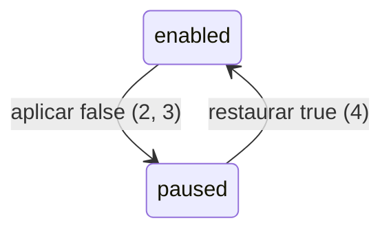

# Pausa temporária do consumidor de notificações

> Construa isto com **tlc-implement**.
> Cada critério abaixo vira uma verificação com prova referenciada por seu número. Nada em
> `Unresolved` é decidido durante a implementação.

## Intent

Uma reserva da demo AWS gera publicação no outbox, mensagem SQS e tentativa SES. Isso cria processamento e custo que não contribuem para a semeadura autorizada de 1.000 clientes fake persistidos.

Ao concluir, o operador poderá declarar a pausa do consumidor por `notification_consumer_enabled=false`; o worker continuará publicando eventos e expirando reservas, mas não consumirá a fila de notificações até a flag ser restaurada. 4 critérios em 1 slice · 1 decisão de configuração · 0 abertas, das quais 0 bloqueiam.

## Criteria

### Consumidor de notificações

1. Dado que `notification_consumer_enabled` não é informado, quando a definição Terraform da task `worker` é avaliada, então `NOTIFICATION_CONSUMER_ENABLED` vale `true`.
2. Dado que `notification_consumer_enabled=false`, quando a definição Terraform da task `worker` é avaliada, então `NOTIFICATION_CONSUMER_ENABLED` vale `false`.
3. Enquanto `notification_consumer_enabled=false`, `OUTBOX_PUBLISHER_ENABLED` e `EXPIRATION_CONSUMER_ENABLED` valem `true`, e a configuração Spring não cria `SqsReservationCreatedConsumer`.
4. Quando o operador pausar e reativar o consumidor, então o runbook define `notification_consumer_enabled=false` antes da semeadura, `true` depois dela e afirma que mensagens existentes na SQS não são apagadas.

## States

## Out of scope

- Seeder AWS e geração Faker.js - consomem a flag em trabalho próprio.
- Descarte, drenagem ou replay de mensagens SQS - a pausa preserva a fila existente.
- Alteração de dados de cliente, reserva, evento ou outbox - nenhum dado é migrado, reescrito ou removido.

## Observable

| Surface | Decision | Landing |
| --- | --- | --- |
| variável Terraform | default e override booleanos | 1, 2 |
| task ECS worker | serviços assíncronos durante a pausa | 3 |
| runbook operacional | sequência de pausa e restauração | 4 |
| API HTTP | contrato e respostas | n/a - nenhuma rota é alterada |

## Swept

- validation: 1, 2
- failure modes: existing - Terraform mantém o último estado aplicado se um deploy não concluir
- idempotency and retry: existing - outbox e a entrega pelo menos uma vez não mudam
- authorization: existing - apenas o operador Terraform autorizado muda a task ECS
- concurrency and ordering: 3 - a pausa não altera publisher, expiração ou a retenção da SQS
- data lifecycle: 4 - dados e mensagens não são removidos pela pausa
- external-dependency failure: 3 - SES não é chamado sem o consumidor; SQS continua publisher
- state transitions: 1, 2, 4
- observability: existing - métricas de fila e DLQ já existentes permanecem disponíveis

## Impact

| Front | What changes |
| --- | --- |
| configuração de infraestrutura | A variável da demo passa a dirigir `NOTIFICATION_CONSUMER_ENABLED` na task worker. |
| configuração Spring existente | `NotificationConsumerProperties.enabled` já governa a criação do consumidor e passa a receber o valor declarado pelo ambiente. |
| dados persistidos | Nada a migrar; clientes, reservas, outbox e mensagens existentes permanecem. |
| operação | O procedimento declara a pausa temporária e a reativação após a semeadura. |

## Decided

| Decision | Shape | Alternative rejected |
| --- | --- | --- |
| Flag operacional | `notification_consumer_enabled: bool = true` no ambiente demo, repassada como `NOTIFICATION_CONSUMER_ENABLED` na task worker | Desabilitar o worker inteiro - interromperia publisher e expiração, que devem permanecer ativos. |

## Sources

- [.specs/features/notification-consumer-toggle/spec.md](../.specs/features/notification-consumer-toggle/spec.md) - requisitos NOTIFY-01 a NOTIFY-03.
- [infra/modules/compute/main.tf](../infra/modules/compute/main.tf) - ambiente atual da task worker.
- [src/main/java/com/cielo/flashbooking/notification/email/SqsReservationCreatedConsumerConfiguration.java](../src/main/java/com/cielo/flashbooking/notification/email/SqsReservationCreatedConsumerConfiguration.java) - flag Spring existente.

## Unresolved

| # | Kind | Question | Until answered |
| --- | --- | --- | --- |
| None |  |  |  |
