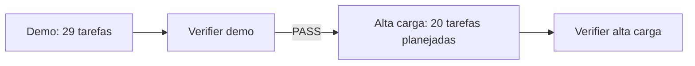

# Planos de execução do Flash Booking

Este projeto possui duas arquiteturas e dois planos de execução independentes.

## 1. Demo

Objetivo: entregar o case completo, funcional, econômico e operável por uma pessoa, com serviços separados de consultas, comandos e worker usando a mesma imagem.

- [Especificação](.specs/features/flash-booking-demo/spec.md)
- [Decisões de contexto](.specs/features/flash-booking-demo/context.md)
- [Arquitetura demo](.specs/features/flash-booking-demo/design.md)
- [Plano de 29 tarefas](.specs/features/flash-booking-demo/tasks.md)

**Gate de saída:** `.specs/features/flash-booking-demo/validation.md` com PASS.

## 2. Alta carga

Objetivo: evoluir a demo por gargalo medido, escalando consultas, comandos e workers separadamente, sem alterar código Java, controllers, schema, migrations, endpoints, autenticação, notificação ou contrato de cache.

- [Especificação](.specs/features/flash-booking-high-load/spec.md)
- [Decisões de contexto](.specs/features/flash-booking-high-load/context.md)
- [Arquitetura de alta carga](.specs/features/flash-booking-high-load/design.md)
- [Plano de 20 tarefas](.specs/features/flash-booking-high-load/tasks.md)

**Pré-requisito:** validação PASS da demo.

**Gate de saída nesta entrega:** `.specs/features/flash-booking-high-load/validation.md` com PASS documental e de infraestrutura estática/mockada. Não representa deploy, carga ou failover remoto.

## Ordem

Os planos não serão executados juntos. A demo é o único ambiente AWS aplicado nesta entrega, por no máximo 1h30. A arquitetura de alta carga reutiliza o mesmo binário, domínio, schema, migrations, autenticação, e-mail e contrato de cache da demo; apenas state, parâmetros e topologia Terraform são próprios. Ela não será aplicada nem testada remotamente nesta entrega.

Antes de qualquer implementação ser considerada concluída, a matriz em [docs/case-requirements-evaluation.md](docs/case-requirements-evaluation.md) deve ser preenchida com evidência executável. Texto de design, isoladamente, não autoriza PASS.
