# Flash Booking

Backend para **reserva temporária de ingressos em flash sales**, desenvolvido como case técnico independente no contexto da Cielo. O sistema protege o último ingresso sob concorrência, expira reservas abandonadas e separa consultas, comandos e trabalho assíncrono sem duplicar as regras de negócio.

> O domínio termina em `PENDING`, `CANCELLED` ou `EXPIRED`. **Pagamento, compra confirmada e emissão de ingresso não fazem parte desta entrega.** Este projeto não é um produto oficial da Cielo.

## TL;DR

| Pergunta | Resposta curta |
| --- | --- |
| O que foi entregue? | Cinco endpoints, três modos do mesmo Java, PostgreSQL, Valkey, mensageria, e-mail, Compose e uma demo AWS completa. |
| Como não ocorre oversell? | O PostgreSQL faz um decremento condicional dentro da mesma transação que persiste cliente, reserva e outbox. |
| Qual é a evidência? | Baseline integral histórico com **PASS em 43/43 critérios** e **38 testes unitários + 56 de integração = 94 aprovados**. Após a correção de idempotência: **46/46 unitários**, ITs compilados e execução PostgreSQL pendente. |
| A AWS continua ativa? | Não. A demo foi aplicada, observada e destruída; 106 recursos removidos e state final vazio. |
| E a arquitetura high-load? | É uma **arquitetura-alvo planejada**, Multi-AZ e com escala independente; não foi provisionada, benchmarkada nem validada remotamente. |

## Executar localmente

Pré-requisitos: Docker Desktop saudável. Java 21 é necessário apenas para executar Maven fora do container.

```powershell
# Sobe Query API, Command API, worker, PostgreSQL, Valkey, SQS local e Mailpit
docker compose up --build --detach

# Exercita evento, reserva, consultas e entrega de e-mail
.\scripts\compose-smoke.ps1

# Encerra a stack
docker compose down
```

| Serviço local | Endereço | Função |
| --- | --- | --- |
| Query API | `http://localhost:8081` | Consultas de eventos e reservas |
| Command API | `http://localhost:8082` | Criação e cancelamento |
| Mailpit | `http://localhost:8025` | Caixa de e-mail da demonstração |

Para executar os gates Java:

```powershell
# 46 testes unitários
.\mvnw.cmd test

# Gate completo atual: 46 unitários + 57 testes de integração
.\mvnw.cmd clean verify -Pintegration
```

Em Linux/macOS, use `./mvnw` no lugar de `.\mvnw.cmd`. O [runbook da demo](docs/demo-runbook.md) cobre autenticação temporária, revisão da infraestrutura e o ciclo de aplicação/destruição; nenhuma credencial é versionada.

## Contrato HTTP

Os comandos mutáveis exigem `Idempotency-Key`. Erros usam `application/problem+json` e as respostas incluem correlation ID.

| Método | Rota | Serviço | Resultado principal |
| --- | --- | --- | --- |
| `POST` | `/events` | Command API | Cria um evento com capacidade positiva |
| `GET` | `/events/{id}` | Query API | Consulta capacidade total e disponível |
| `POST` | `/events/{id}/reservations` | Command API | Cria cliente e reserva `PENDING` sem exceder estoque |
| `GET` | `/reservations/{id}` | Query API | Consulta a reserva e referencia o evento por `id` e `name` |
| `DELETE` | `/reservations/{id}` | Command API | Antes do prazo cancela; no prazo/depois materializa expiração; devolve capacidade uma vez |

A coleção [Postman para a demo AWS](postman/README.md) contém as cinco chamadas e o fluxo IAM/SigV4, mas o endpoint é deliberadamente temporário e não está ativo.

## Como o último ingresso é protegido

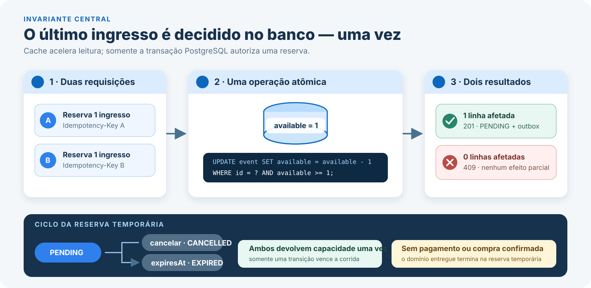

O caminho síncrono é curto e autoritativo:

1. a Command API valida o cliente e a chave de idempotência;
2. uma transação PostgreSQL tenta decrementar `available` somente se ainda houver quantidade suficiente;
3. o vencedor persiste cliente, reserva `PENDING` e eventos no outbox;
4. o perdedor recebe `409` sem cliente, reserva ou outbox parcial;
5. somente depois do commit o cache de disponibilidade do evento é invalidado.

O caminho assíncrono começa **depois** da resposta da reserva. O worker publica o outbox nas filas de expiração e notificação, consome mensagens com idempotência, envia o e-mail e reconcilia reservas vencidas. Cache e filas nunca autorizam estoque; o PostgreSQL continua sendo a fonte de verdade.

O prazo também prevalece no caminho síncrono. O PostgreSQL bloqueia a reserva e só então decide pelo próprio relógio: um `DELETE` antes de `expiresAt` retorna `CANCELLED`; em `expiresAt` ou depois retorna `EXPIRED`. A primeira transição devolve capacidade e invalida o cache; concorrentes apenas observam o estado terminal já persistido.

## Consistência eventual e peças AWS

O [case original](<Case BackEnd 1.md>) pede **consistência eventual para disponibilidade**. No Flash Booking isso não significa estoque eventual: a Command API confirma inventário, reserva e dois eventos no outbox em uma única transação PostgreSQL antes de responder `201`. O que converge depois é a projeção de leitura e os efeitos derivados:

- somente `GET /events/{id}` usa Valkey em cache-aside; miss ou falha volta ao PostgreSQL e `GET /reservations/{id}` não passa pelo cache;
- a invalidação ocorre depois do commit e é best effort; se falhar, o TTL de no máximo 1 segundo limita a janela desatualizada;
- o worker publica o outbox em filas SQS separadas para expiração e notificação; redelivery é tratada por transição condicional ou deduplicação, com DLQ após cinco recebimentos;
- em condição saudável, a expiração converge até `expiresAt + 5s` e a solicitação ao SES ocorre em até 30 segundos. Esses limites não prometem entrega exatamente uma vez nem entrega do e-mail na caixa postal.

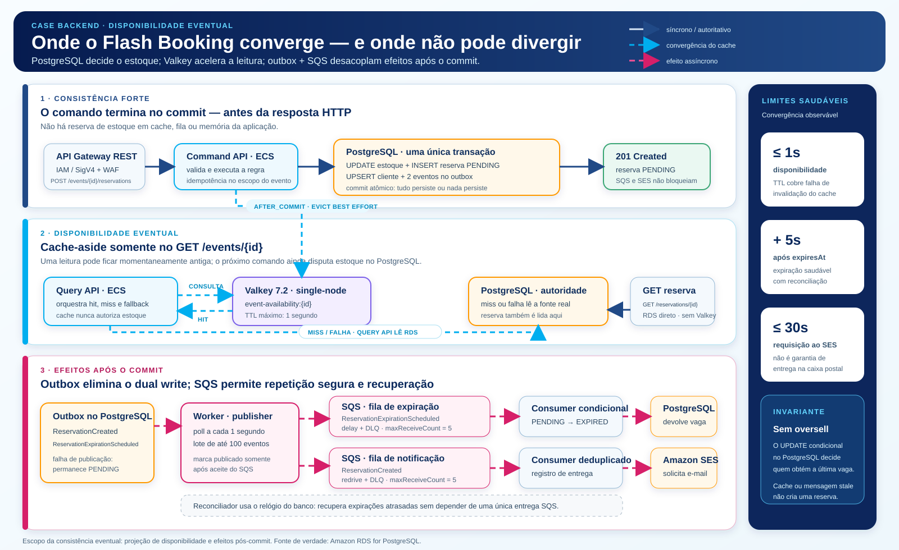

<details>
<summary><strong>AWS · Demo provisionada e validada</strong></summary>

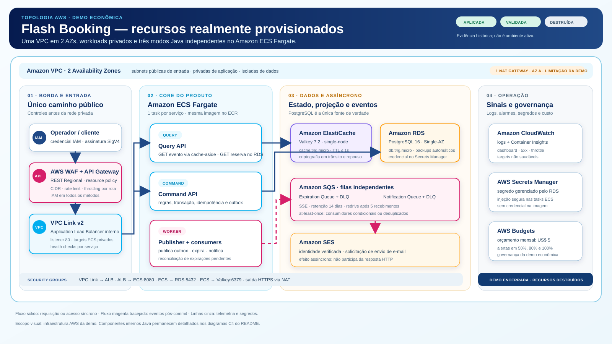

A demo priorizou custo: uma task por modo Java, RDS Single-AZ, Valkey single-node e um NAT Gateway. API Gateway era o único ponto público; ALB, ECS, RDS e Valkey permaneciam privados. A evidência é histórica porque os recursos foram destruídos ao final da validação.

</details>

<details>
<summary><strong>AWS · Arquitetura-alvo high-load</strong></summary>

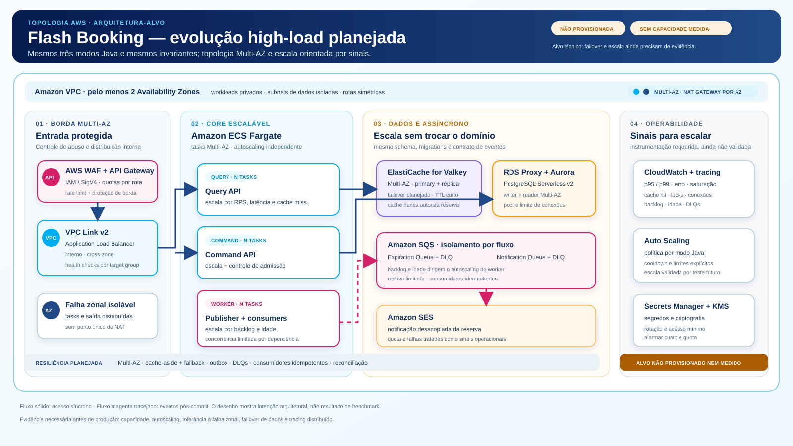

O alvo preserva os três modos da mesma aplicação Java e troca a topologia operacional: tasks Multi-AZ, autoscaling independente, Aurora PostgreSQL com RDS Proxy, Valkey Multi-AZ e NAT por AZ. É um plano, não uma alegação de capacidade, failover ou benchmark executado.

</details>

## Idempotência na prática

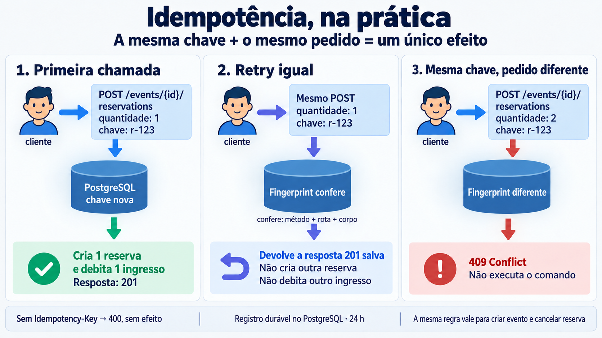

Os comandos de criar evento, reservar e cancelar exigem `Idempotency-Key`. A primeira chamada salva chave, operação, alvo normalizado, hash do payload, status e corpo da resposta no PostgreSQL. Durante 24 horas, um retry idêntico devolve o resultado persistido sem repetir o efeito e reutilizar a chave para outro pedido retorna `409`; omiti-la retorna `400` sem executar o comando. No vencimento medido pelo banco, a chave pode ser reivindicada atomicamente como um comando novo. O worker remove linhas vencidas em lotes, mas a limpeza não prolonga nem encurta a janela. A decisão completa está no [ADR 0007](docs/adr/0007-idempotencia-persistente-de-comandos.md).

## Desenvolvimento orientado por especificação

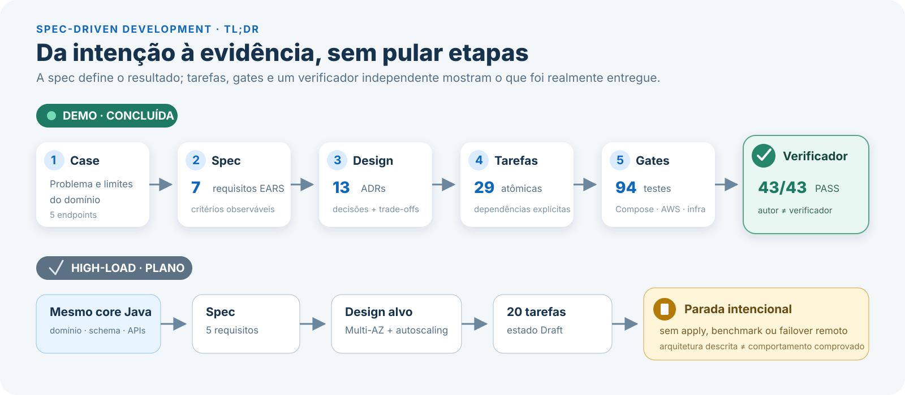

Cada critério foi escrito antes da implementação, ligado a tarefas e validado contra uma saída observável. O fluxo completo da demo foi:

`case → spec EARS → design + ADRs → tarefas atômicas → testes/gates → verificador independente`

A IA ajudou a estruturar especificações, alternativas, tarefas, testes, infraestrutura e documentação. As decisões de domínio, segurança, custo e escopo permaneceram explícitas no repositório; credenciais AWS não foram fornecidas à IA nem versionadas. O histórico pré-implementação foi preservado em [.specs/REVIEW.md](.specs/REVIEW.md), claramente rotulado como registro histórico.

## Demo versus arquitetura-alvo

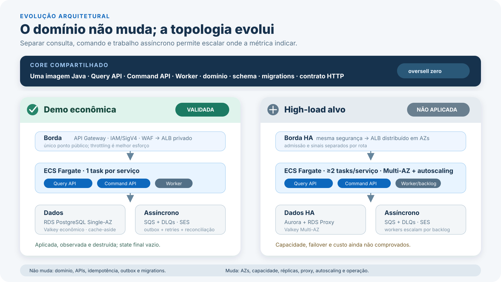

A aplicação inicia **uma única imagem Java** em três modos. A arquitetura high-load futura preserva esses modos e as regras de negócio, mas pode acrescentar adaptadores operacionais para sua topologia:

- `query-api`: atende os dois GETs; somente a disponibilidade de evento usa cache-aside;
- `command-api`: cria eventos, reserva e cancela com transações autoritativas;
- `worker`: publica outbox, expira/reconcilia reservas e envia notificações.

| Dimensão | Demo validada | High-load planejada |
| --- | --- | --- |
| Objetivo | Menor custo e operação por uma pessoa | Disponibilidade e escala guiadas por gargalo medido |
| Compute | Uma task ECS por serviço | Múltiplas tasks Multi-AZ e autoscaling independente |
| Dados | RDS PostgreSQL Single-AZ e Valkey econômico | Aurora PostgreSQL, RDS Proxy e Valkey Multi-AZ |
| Assíncrono | Filas e DLQs separadas; um worker | Workers escalados por backlog e idade da mensagem |
| Estado | Aplicada, observada, validada e destruída | Design + 20 tarefas Draft; sem runtime remoto |

O gatilho de evolução não é “mais componentes”. São métricas: saturação do writer, p95/p99 por rota, conexões, hit rate, backlog e idade da mensagem. O core, os controllers, o schema, as migrations, a idempotência e o outbox permanecem iguais.

## Evidência de qualidade

| Gate | Resultado | O que comprova |
| --- | ---: | --- |
| Critérios de aceitação | **Baseline 43/43 PASS** | Cinco rotas, erros, idempotência, cache, expiração, notificação, segurança e runtime antes da correção atual |
| Testes unitários | **46/46** | Regras, serviços e configuração de limpeza de idempotência |
| Testes de integração | **56/56 no baseline; 57 atuais compilados** | A execução PostgreSQL da nova janela idempotente permanece pendente; compilação não é contada como execução |
| Sensor de discriminação | **2/2 mutações mortas** | Os testes falham quando segurança ou decremento de estoque são quebrados |
| Compose smoke | **PASS** | Query, command, worker, banco, cache, fila e Mailpit integrados |
| Módulos de infraestrutura | **4/4 PASS** | Rede, dados, compute e edge/observabilidade |
| Demo AWS | **PASS** | Apply, serviços saudáveis, IAM/CIDR, DLQs, SES e destroy |

O relatório com `file:line`, assertions e observações remotas está em [validation.md](.specs/features/flash-booking-demo/validation.md). A [avaliação contra o case](docs/case-requirements-evaluation.md) distingue implementação, validação e arquitetura-alvo.

## Testes de carga

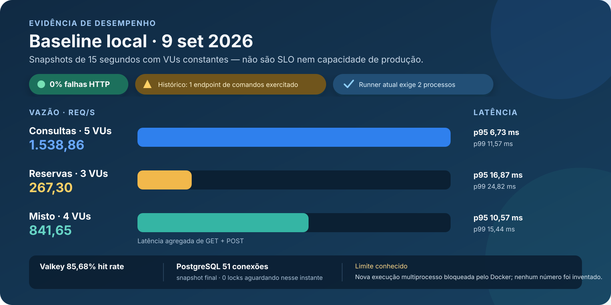

O baseline canônico contém VUs constantes por 15 segundos, percentis e zero falhas HTTP nos três cenários. Ele serve para comparação local, **não** como SLO, limite sustentável ou alegação de capacidade AWS.

Há uma limitação importante: a execução histórica acima iniciou réplicas extras, mas chamou apenas o endpoint de comandos publicado em `localhost:8082`; por isso ela não comprova distribuição multiprocesso. O runner atual descobre duas portas de réplicas e distribui os VUs explicitamente, porém a reexecução de 2026-09-14 foi bloqueada antes da carga por uma falha local do Docker Desktop. Nenhum número novo foi inventado.

Dados, proveniência e procedimento de reprodução: [performance/demo/README.md](performance/demo/README.md) e [baseline.json](performance/demo/baseline.json).

## Resiliência, segurança e observabilidade

| Risco | Padrão aplicado | Sinal ou evidência |
| --- | --- | --- |
| Oversell e corrida terminal | Lock, relógio PostgreSQL, transição condicional, constraints e transação única | Fronteira de `expiresAt`, espera por lock, motivo, disponibilidade e testes concorrentes |
| Retry de comando | Idempotência PostgreSQL por 24 h, ligada a operação/alvo/hash | Repetição igual, conflito `409` e registro persistido |
| Mensagem perdida ou duplicada | Transactional outbox, consumidor idempotente, retry limitado e DLQ por fluxo | Backlog, idade da mensagem, DLQ e logs correlacionados |
| Cache de evento lento ou indisponível | Timeout de 100 ms, bulkhead de 5 fallbacks/task e circuito após 5 falhas em 10 s | Hits/misses, fallback, circuito e pressão no PostgreSQL |
| Expiração atrasada | SQS com atraso + reconciliador usando o relógio UTC do banco | Idade da fila e conclusão até `expiresAt + 5s` em condição saudável |
| Falha de e-mail | Notificação desacoplada, retry e DLQ; estoque não é revertido | Estado de entrega, aceite do SES e DLQ de notificação |
| Abuso na borda | IAM/SigV4, resource policy, allowlist, WAF e throttling de melhor esforço | `403`, logs do API Gateway/WAF e distribuição de respostas |

Na demo AWS, API Gateway era a única entrada pública; ALB, ECS, RDS e Valkey não recebiam tráfego direto de clientes. Logs e alarmes do CloudWatch foram separados por serviço e dependência, com correlation ID atravessando a API. Os limites do API Gateway e o AWS Budget são camadas de redução de risco — não garantem `429` determinístico nem um teto financeiro imediato.

## Limites e trade-offs assumidos

- A demo troca alta disponibilidade por custo: uma task por serviço, RDS Single-AZ e NAT único.
- O benchmark é curto e local; não mede soak, saturação progressiva, failover ou custo por carga.
- O snapshot final de PostgreSQL não prova ausência de lock waits durante toda a execução.
- High-load ainda não comprova capacidade, RTO/RPO, failover, atraso de réplica ou operação Multi-AZ.
- IAM/SigV4 autentica operadores/avaliadores na borda; cadastro e login de cliente final estão fora do case.
- Pagamento, compra confirmada, frontend e CI/CD permanecem fora do escopo.

## Diagramas detalhados

Os resumos acima são a trilha principal. As vistas completas ficam aqui para análise arquitetural e de código.

<details>
<summary><strong>C4 · Demo AWS validada</strong></summary>

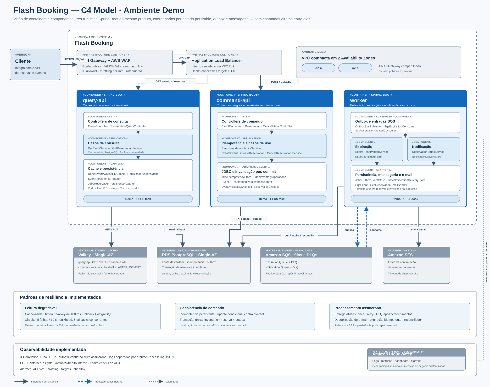

Contexto, containers Java, dependências AWS, resiliência e observabilidade da topologia econômica executada.

</details>

<details>
<summary><strong>C4 · Arquitetura-alvo high-load</strong></summary>

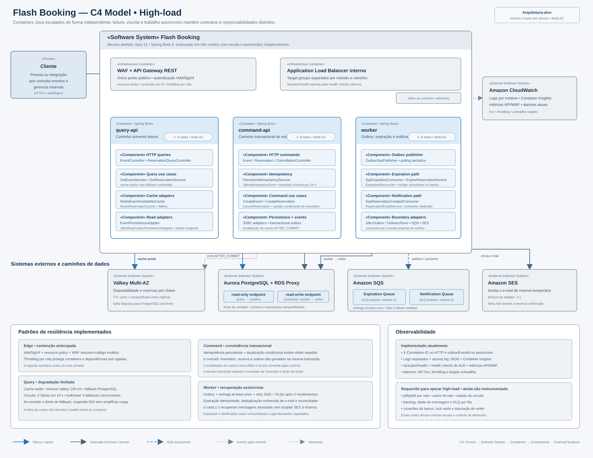

Evolução Multi-AZ e escala independente. Esta vista representa intenção arquitetural, não um ambiente provisionado.

</details>

<details>
<summary><strong>C4 · Componentes dos três modos Java</strong></summary>

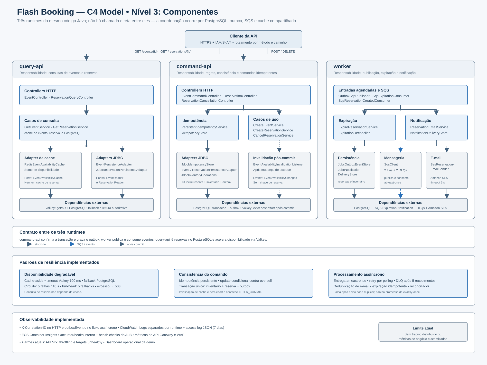

Controllers, serviços de aplicação, portas e adaptadores compartilhados por Query API, Command API e worker.

</details>

<details>
<summary><strong>Sequência · reserva, outbox, cache, expiração e e-mail</strong></summary>

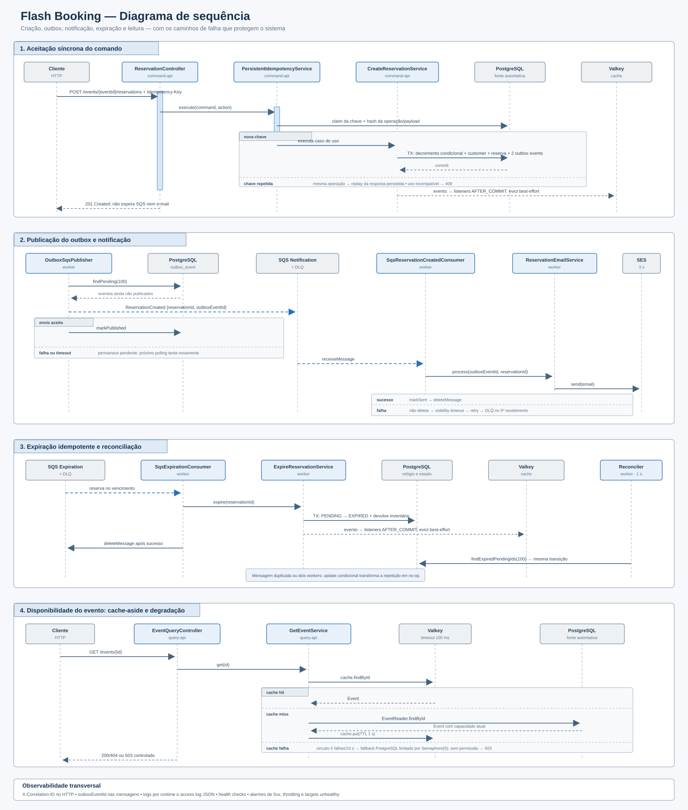

Separa a transação síncrona da publicação e dos consumidores assíncronos, incluindo retries, DLQs e reconciliação.

</details>

## Mapa da documentação

| Quero entender… | Comece por |
| --- | --- |
| O enunciado original | [Case BackEnd 1.md](Case%20BackEnd%201.md) |
| Requisitos e prova da demo | [spec](.specs/features/flash-booking-demo/spec.md) · [31 tarefas](.specs/features/flash-booking-demo/tasks.md) · [validação](.specs/features/flash-booking-demo/validation.md) |
| Evolução high-load | [spec](.specs/features/flash-booking-high-load/spec.md) · [design](.specs/features/flash-booking-high-load/design.md) · [20 tarefas planejadas](.specs/features/flash-booking-high-load/tasks.md) |
| Modelo de dados | [Customer → Reservation → Event](docs/data-model.md) |
| Decisões e trade-offs | [PostgreSQL autoritativo](docs/adr/0004-postgresql-como-fonte-autoritativa.md) · [cache](docs/adr/0005-cache-valkey-compartilhado-e-binario-unico.md) · [segurança](docs/adr/0012-autenticacao-e-protecao-de-custos-na-borda.md) · [serviços](docs/adr/0013-separar-servicos-de-consulta-e-comando.md) |
| Operar ou apresentar a demo | [runbook](docs/demo-runbook.md) · [Postman](postman/README.md) · [custos](docs/cost-estimate.md) |
| Perguntas de arquitetura | [avaliação do case](docs/case-requirements-evaluation.md) · [PostgreSQL como fonte autoritativa](docs/adr/0004-postgresql-como-fonte-autoritativa.md) |
| Carga local | [metodologia e limites](performance/demo/README.md) · [dados canônicos](performance/demo/baseline.json) |
