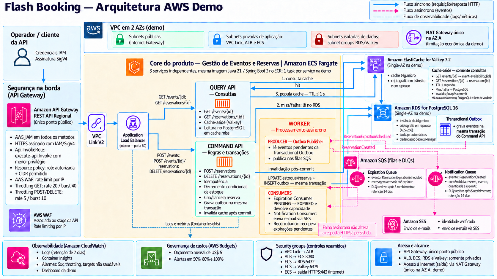
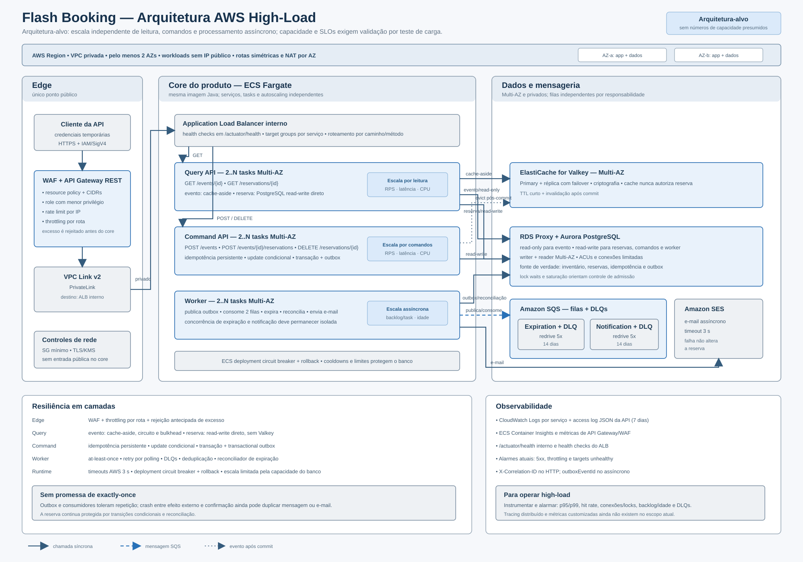

# Flash Booking - Cielo Backend Case

Este repositório parte do case de reserva de ingressos.

## Requisitos

- [Enunciado consolidado](Case%20BackEnd%201.md)
- Cinco endpoints REST para eventos e reservas.
- Múltiplas instâncias, oversell zero, expiração automática e idempotência.
- Java, Spring Boot, testes automatizados e Docker Compose.
- Runtime integralmente na AWS, provisionado por Terraform.
- Uso de IA documentado e decisões explicáveis no Case Review.

## Planos de execução

As duas arquiteturas compartilham o mesmo código Java, controllers, schema, migrations, endpoints, autenticação, notificação e contrato de cache. O que muda é a infraestrutura AWS e a configuração de runtime injetada por Terraform.

A mesma imagem inicia em serviços separados de consultas, comandos e worker. Isso permite escalar GETs e reservas de forma independente sem criar regras de negócio específicas de carga.

Os planos são independentes e sequenciais:

1. [Arquitetura demo](.specs/features/flash-booking-demo/design.md): econômica, completa e operável por uma pessoa.
   

2. [Arquitetura de alta carga](.specs/features/flash-booking-high-load/design.md): Multi-AZ, consultas e reservas escaladas separadamente.

## Diagramas de arquitetura

### Demo

### Arquitetura-alvo high-load

O diagrama high-load é a topologia-alvo. Ela permanece sem provisionamento e validação remota nesta entrega.

### C4 Model — componentes Java

O diagrama apresenta os componentes implementados nos perfis `query-api`, `command-api` e `worker`, incluindo portas, adaptadores, padrões de resiliência e a observabilidade disponível.

### Sequência de reserva

O fluxo separa a resposta síncrona do comando da publicação do outbox, das notificações, da expiração e da leitura cache-aside, incluindo retry, DLQ, reconciliação e fallback.

O índice consolidado está em [IMPLEMENTATION_PLAN.md](IMPLEMENTATION_PLAN.md).

A relação entre cliente, reserva e evento está em [docs/data-model.md](docs/data-model.md). A cobertura do case, com limites de evidência, está em [docs/case-requirements-evaluation.md](docs/case-requirements-evaluation.md).

As explicações sobre concorrência, oversell, consistência eventual, cache, autenticação e e-mail estão em [docs/perguntas-e-respostas.md](docs/perguntas-e-respostas.md).

## Ordem de entrega

1. Executar as [29 tarefas da demo](.specs/features/flash-booking-demo/tasks.md).
2. Obter validação independente PASS da demo.
3. Medir o envelope de capacidade.
4. Preparar e validar estaticamente as [20 tarefas de alta carga](.specs/features/flash-booking-high-load/tasks.md) somente quando os gatilhos justificarem. Não aplicar esse ambiente nem executar testes remotos nesta entrega.

CI/CD não faz parte do escopo. A demo é o único ambiente AWS a ser aplicado e fica ativa no máximo 1h30; a arquitetura de alta carga é documentação, testes estáticos/mockados e plano futuro. Os planos documentam build, testes, publicação manual da imagem e provisionamento por Terraform sem exigir recursos criados pelo console AWS.

## Credenciais para a demonstração

O caminho recomendado é autenticar no host, não dentro do container da aplicação:

1. O provisionador usa um perfil com credenciais temporárias na AWS CLI da própria máquina. Com AWS CLI 2.32 ou posterior, `aws login --profile flash-booking-demo` fornece credenciais curtas e renováveis; se a organização já usa IAM Identity Center, deve-se manter o fluxo existente com `aws sso login`.
2. Terraform recebe o perfil explicitamente, sem chaves em `*.tfvars`, imagem, repositório ou variáveis versionadas.
3. Cada operador ou entrevistador assume `ApiInvokerRole`, limitada a `execute-api:Invoke`, e assina as chamadas com SigV4. A role de invocação não pode provisionar nem destruir infraestrutura.
4. Os containers da aplicação usam ECS task roles. Eles nunca recebem nem montam o diretório de credenciais do operador.

Executar AWS CLI/Terraform em um container de ferramentas seria possível, mas exigiria repassar o perfil e renovar a sessão através do volume montado. Para uma única pessoa e uma janela curta, isso aumenta o risco de expor credenciais sem melhorar a reprodutibilidade da aplicação. Docker Compose e testes locais não exigem credenciais AWS reais.

API Gateway REST, resource policy, WAF e throttling protegem o único ponto público; veja o [ADR 0012](docs/adr/0012-autenticacao-e-protecao-de-custos-na-borda.md). Instruções oficiais: [login pela AWS CLI](https://docs.aws.amazon.com/signin/latest/userguide/command-line-sign-in.html) e [boas práticas de IAM](https://docs.aws.amazon.com/IAM/latest/UserGuide/best-practices.html).

O e-mail enviado após `ReservationCreated` confirma uma reserva temporária, não uma compra. Docker Compose usa Mailpit; AWS usa SES com identidades verificadas durante a demonstração.
