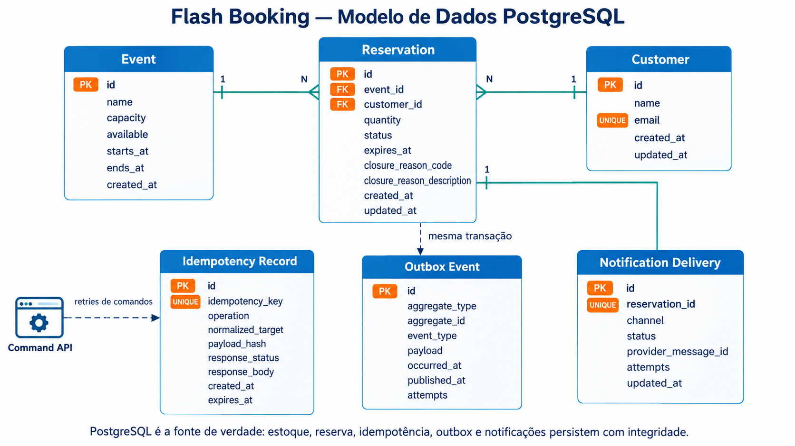
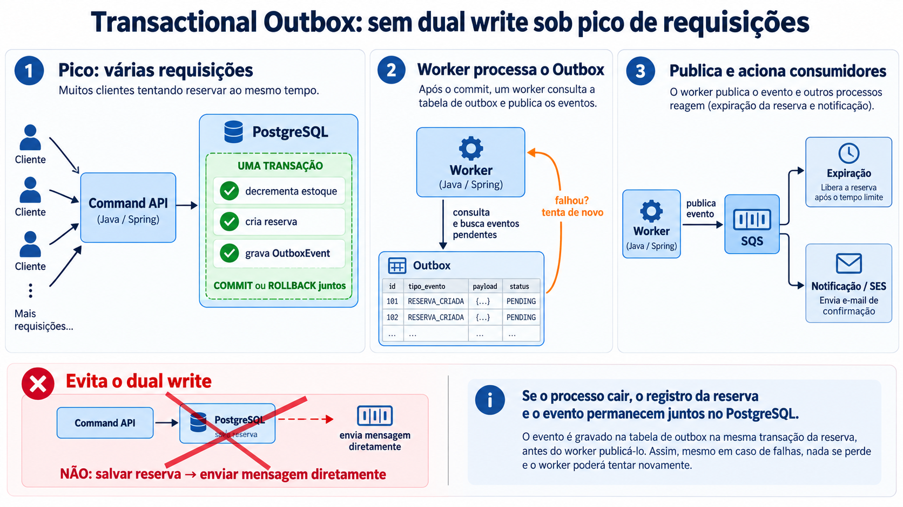

# Flash Booking

Backend de reserva temporária de ingressos para flash sales. O escopo termina em `PENDING`, `CANCELLED` ou `EXPIRED`; não inclui pagamento, compra confirmada ou emissão de ingresso.

## Fonte de verdade

`.specs/` define o sistema atual. Ela concentra requisitos, arquitetura, decisões, tarefas e evidências de validação. Em caso de conflito, a especificação prevalece sobre qualquer outro documento.

| Assunto | Fonte |
| --- | --- |
| Requisitos, design e validação da demo | [flash-booking-demo](.specs/features/flash-booking-demo/spec.md) · [design](.specs/features/flash-booking-demo/design.md) · [validation](.specs/features/flash-booking-demo/validation.md) |
| Janela de flash sale atual | [flash-sale-window](.specs/features/flash-sale-window/spec.md) · [validation](.specs/features/flash-sale-window/validation.md) |
| Evolução high-load não implementada | [spec](.specs/features/flash-booking-high-load/spec.md) · [design](.specs/features/flash-booking-high-load/design.md) · [tasks](.specs/features/flash-booking-high-load/tasks.md) |
| Decisões globais e glossário | [STATE](.specs/STATE.md) · [glossário](.specs/CONTEXT.md) |
| Enunciado original | [Case BackEnd 1.md](Case%20BackEnd%201.md) |

## Rodar localmente

O guia de execução, debug no IntelliJ, portas, credenciais e solução de problemas está em [Rodar localmente](docs/rodar-localmente.md).

```powershell
docker compose up --build --detach
.\scripts\compose-smoke.ps1
```

Para a suite completa de testes:

```powershell
.\mvnw.cmd clean verify -Pintegration
```

## Estado da entrega

- A demo AWS está provisionada para a janela atual. O RDS aceita DataGrip local somente pela exceção temporária documentada em [Acesso temporário ao RDS pelo DataGrip](docs/acesso-rds-datagrip.md); desligue-a e destrua a demo ao final.
- A arquitetura high-load é somente desenho de evolução. Não foi provisionada, submetida a carga remota ou validada quanto a failover.
- A evidência atual da aplicação está nas validações em `.specs/`; a execução local mais recente aprovou 121 testes, incluindo 68 integrações.

## E-mail de reserva temporária

Ao registrar uma reserva, o worker publica a notificação pela fila SQS e a entrega pelo provedor configurado (SES na demo AWS). O conteúdo atual é texto simples; ele informa que a reserva **não** confirma compra nem pagamento.

```text
Para: ana.silva@example.test
Assunto: Reserva temporária registrada

Sua reserva temporária foi registrada.

Reserva: 6d637907-46e1-4fbc-9af1-6972b5942892
Evento: Festival de Música
Quantidade: 2
Válida até: 2026-09-24T15:30:00Z

Esta reserva é temporária e não confirma compra nem pagamento.
```

Durante uma semeadura com dados fake, é possível pausar somente esse consumidor, mantendo outbox e expiração ativos. O procedimento para desligar e reativar `notification_consumer_enabled` está em [Pausar notificações durante a semeadura AWS](docs/pausar-notificacoes-semeadura.md). Mensagens já publicadas permanecem na SQS para processamento quando o consumidor voltar a ser habilitado.

## Visões de estudo

O modelo completo e os contratos de consistência permanecem nas [especificações da demo](.specs/features/flash-booking-demo/design.md). Estes diagramas oferecem uma leitura rápida da persistência e do fluxo assíncrono.

### Modelo de dados



### Transactional outbox sob pico de requisições



## Material operacional e evidências complementares

| Material | Uso |
| --- | --- |
| [Postman](postman/README.md) | Executar a coleção local ou preparar uma demonstração AWS autorizada |
| [Baseline de desempenho](performance/demo/README.md) | Proveniência, limites e reprodução de benchmark local |
| [Carga dinâmica fake](performance/dynamic-load/README.md) | Perfis locais, dados sintéticos, telemetria e limites de evidência |
| [Módulos Terraform](infra/modules) | Contexto operacional da infraestrutura versionada |
| [Gerador de áudio](scripts/generate-interview-audio.ps1) | Gerar localmente uma narração WAV a partir de texto UTF-8 |
