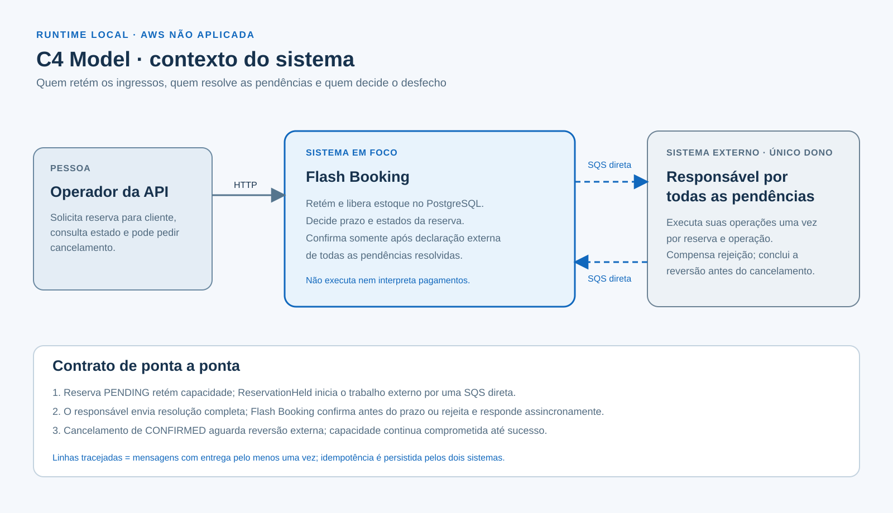
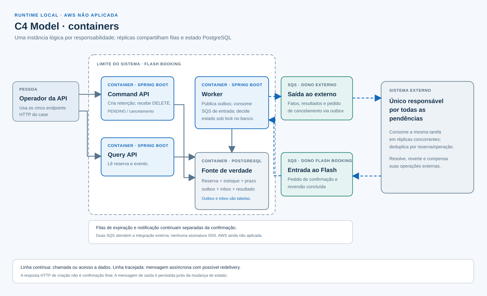
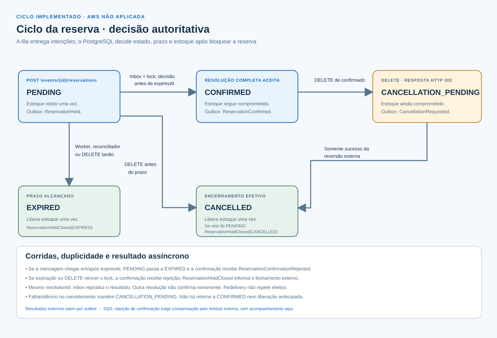
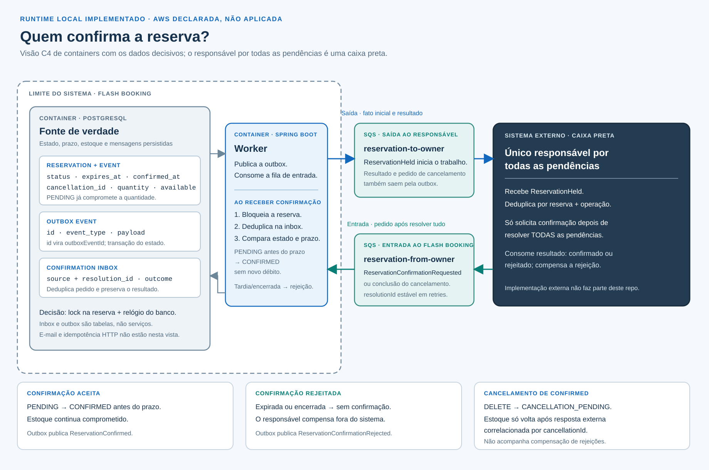

# Flash Booking

Este é um case técnico independente da Cielo sobre reserva temporária e confirmação de reservas para flash sales. O Flash Booking retém ingressos em `PENDING` e só os torna `CONFIRMED` depois de receber uma declaração assíncrona do único módulo externo responsável por resolver todas as pendências. O Flash Booking não processa pagamentos, não interpreta o estado financeiro e não emite ingressos.

## Fonte de verdade

`.specs/` é a fonte autoritativa do sistema e concentra requisitos, arquitetura, decisões, tarefas e evidências de validação. Em caso de conflito, a especificação aplicável à versão descrita prevalece sobre qualquer outro documento.

| Assunto | Fonte |
| --- | --- |
| Requisitos, design e validação da demo | [flash-booking-demo](.specs/features/flash-booking-demo/spec.md) · [design](.specs/features/flash-booking-demo/design.md) · [validation](.specs/features/flash-booking-demo/validation.md) |
| Janela de flash sale atual | [flash-sale-window](.specs/features/flash-sale-window/spec.md) · [validation](.specs/features/flash-sale-window/validation.md) |
| Evolução high-load não implementada | [spec](.specs/features/flash-booking-high-load/spec.md) · [design](.specs/features/flash-booking-high-load/design.md) · [tasks](.specs/features/flash-booking-high-load/tasks.md) |
| Ciclo completo da reserva | [spec](.specs/features/reservation-confirmation/spec.md) · [decisões](.specs/features/reservation-confirmation/context.md) · [design](.specs/features/reservation-confirmation/design.md) |
| Auditoria de documentação e desenhos | [inventário de artefatos e evidências](.specs/features/reservation-confirmation/documentation-audit.md) |
| Runtime e observabilidade | [Spring Boot 4 / Jackson 3 / OTLP](.specs/features/spring-boot-4-observability/spec.md) · [plano AWS não aplicado](.specs/features/spring-boot-4-observability/aws-plan.md) |
| Decisões globais e glossário | [STATE](.specs/STATE.md) · [glossário](.specs/CONTEXT.md) |
| Enunciado original | [Case BackEnd 1.md](Case%20BackEnd%201.md) |

## Rodar localmente

O guia de execução, debug no IntelliJ, portas, credenciais e solução de problemas está em [Rodar localmente](docs/rodar-localmente.md).

```powershell
docker compose up --build --detach
.\scripts\compose-smoke.ps1
```

Para a suite completa de testes:

```powershell
.\mvnw.cmd clean verify -Pintegration
```

## Runtime e observabilidade

O runtime atual usa Java 21, Spring Boot 4.0.8, Maven e Jackson 3. O mesmo monólito modular inicia nos processos `query-api`, `command-api` e `worker`. Métricas e traces HTTP OTLP ficam desligados por padrão; a demonstração local opt-in e o collector estão em [Spring Boot 4 / observabilidade](.specs/features/spring-boot-4-observability/spec.md). O plano de envio à AWS ainda não foi implantado e não altera os dashboards existentes.

## Estado da entrega

- A demo AWS está provisionada para a janela atual. O RDS aceita DataGrip local somente pela exceção temporária documentada em [Acesso temporário ao RDS pelo DataGrip](docs/acesso-rds-datagrip.md); desligue-a e destrua a demo ao final.
- A arquitetura high-load é somente desenho de evolução. Não foi provisionada, submetida a carga remota ou validada quanto a failover.
- O ciclo de confirmação externa está implementado no runtime local: schema, outbox/inbox, consumidores SQS, estados, contratos HTTP e testes com um responsável externo simulado. A infraestrutura AWS correspondente está declarada em Terraform, mas não foi aplicada nem integrada a um responsável externo real.
- A suíte completa mais recente deve ser conferida pela validação desta mudança; ela cobre a confirmação, rejeição, expiração e cancelamento assíncronos sem implementar pagamentos.

## Ciclo da reserva

Os cinco endpoints do [case](Case%20BackEnd%201.md) continuam disponíveis. O `POST` retorna `201` depois de reter estoque e persistir `PENDING`; esse aceite não conclui a reserva. Um único módulo externo resolve todas as pendências e envia uma confirmação pela fila de entrada. O Flash Booking verifica o estado e o prazo após bloquear a reserva; se ainda elegível, persiste `CONFIRMED` e `confirmedAt` sem debitar estoque outra vez. A confirmação significa compromisso da reserva, não pagamento.

| Operação atual | Resultado executável |
| --- | --- |
| `POST /events` | Cria evento. |
| `GET /events/{id}` | Consulta disponibilidade eventualmente consistente; a escrita no PostgreSQL decide o estoque. |
| `POST /events/{id}/reservations` | Cria retenção `PENDING` e agenda efeitos pela outbox. |
| `GET /reservations/{id}` | Consulta estado, prazo e, após confirmação, `confirmedAt`. |
| `DELETE /reservations/{id}` | Encerra `PENDING` imediatamente como `CANCELLED` ou `EXPIRED`; para `CONFIRMED`, registra `CANCELLATION_PENDING` e retorna `202`. |

```text
POST → PENDING ── confirmação externa aceita antes do prazo ──→ CONFIRMED
             ├── cancelamento/expiração ──→ CANCELLED | EXPIRED
             └── confirmação tardia ──→ rejeição correlacionada
CONFIRMED ── DELETE/202 ──→ CANCELLATION_PENDING ── conclusão externa ──→ CANCELLED
```

### Confirmação externa sem módulo de pagamentos

Um **único módulo externo** é responsável por resolver todas as pendências da reserva, inclusive pagamento se ele existir. Flash Booking não conhece os detalhes dessas pendências: ele decide prazo, estado e estoque. `CONFIRMED` significa que esse responsável declarou todas as pendências resolvidas **e** que os ingressos continuam comprometidos. Não há confirmação parcial.

Ao criar `PENDING`, a mesma transação grava `ReservationHeld` na outbox. O worker o publica em uma SQS direta consumida pelas réplicas do único responsável. Esse módulo deduplica a operação externa por reserva e operação; a fila e a outbox podem entregar de novo. Quando tudo estiver resolvido, ele envia `ReservationConfirmationRequested` à SQS de entrada do Flash Booking. O worker usa inbox durável e o relógio PostgreSQL **após bloquear a reserva**. Se ainda estiver `PENDING` antes de `expiresAt`, passa a `CONFIRMED` sem debitar estoque outra vez e publica `ReservationConfirmed` pela outbox. Uma mensagem entregue tarde ou concorrente com o encerramento recebe `ReservationConfirmationRejected`; o módulo externo cuida da própria compensação. O Flash Booking não acompanha essa compensação.

`DELETE` de `PENDING` é imediato e publica `ReservationHoldClosed(CANCELLED)` ou `ReservationHoldClosed(EXPIRED)` ao responsável externo na mesma transação do fechamento. `DELETE` de `CONFIRMED` passa a `CANCELLATION_PENDING`, retorna `202` e envia `ReservationCancellationRequested` pela outbox; o estoque só volta após resposta externa positiva e deduplicada. Falha ou silêncio externo mantêm o cancelamento pendente e os ingressos comprometidos. Uma vez solicitado, o cancelamento não volta a `CONFIRMED`.

O Compose/LocalStack executa a integração com filas simuladas. Terraform declara as duas filas direcionais e permissões, mas a infraestrutura AWS não foi aplicada e nenhum responsável externo real está integrado.

<details>
<summary>Ver C4 Model e ciclo de confirmação</summary>

#### C4 Model — contexto do sistema



#### C4 Model — containers



#### Estados e corridas



O [contrato e a análise de corridas](.specs/features/reservation-confirmation/design.md) detalham idempotência, ordenação de mensagens, decisão temporal e responsabilidade pela compensação.

</details>

## E-mail de reserva temporária

Ao registrar uma reserva, o worker publica a notificação pela fila SQS e a entrega pelo provedor configurado (SES na demo AWS). O conteúdo atual é texto simples; ele informa que a reserva **não** confirma compra nem pagamento.

```text
Para: ana.silva@example.test
Assunto: Reserva temporária registrada

Sua reserva temporária foi registrada.

Reserva: 6d637907-46e1-4fbc-9af1-6972b5942892
Evento: Festival de Música
Quantidade: 2
Válida até: 2026-09-24T15:30:00Z

Esta reserva é temporária e não confirma compra nem pagamento.
```

Durante uma semeadura com dados fake, é possível pausar somente esse consumidor, mantendo outbox e expiração ativos. O procedimento para desligar e reativar `notification_consumer_enabled` está em [Pausar notificações durante a semeadura AWS](docs/pausar-notificacoes-semeadura.md). Mensagens já publicadas permanecem na SQS para processamento quando o consumidor voltar a ser habilitado.

## Visões de estudo

O schema e os contratos de consistência permanecem nas [especificações da demo](.specs/features/flash-booking-demo/design.md). Os diagramas de dados e outbox mostram tabelas e eventos, enquanto o [design da confirmação](.specs/features/reservation-confirmation/design.md) detalha o contrato da inbox e as mensagens de integração.

### Fronteiras e dados da confirmação



O desenho mostra apenas os dados que participam da decisão de confirmação. O [contrato completo do banco e das mensagens](.specs/features/reservation-confirmation/design.md) detalha os demais campos e fluxos.

### Transactional outbox sob pico de requisições


O diagrama da outbox mostra o exemplo de criação e notificação; resultados de confirmação, fechamento de retenção e pedido de cancelamento usam o mesmo mecanismo transacional e seguem pela fila direta do responsável externo.

<details>
<summary>Ver os demais diagramas da versão atual e do alvo high-load</summary>

| Vista | Escopo |
| --- | --- |
| [C4 da demo](docs/images/flash-booking-c4-demo.svg) | Topologia da implantação AWS histórica, anterior às filas externas novas; essa implantação foi destruída. |
| [Componentes](docs/images/flash-booking-c4-components.svg) | Perfis do runtime local, incluindo consumidor de confirmação; as novas filas AWS ainda não foram aplicadas. |
| [Sequência](docs/images/flash-booking-sequence-reservation.svg) | Recorte de criação, notificação, expiração e consulta; a confirmação está na vista lifecycle acima. |
| [Consistência eventual AWS](docs/images/flash-booking-aws-eventual-consistency.svg) · [topologia AWS da demo](docs/images/flash-booking-aws-demo.svg) | Fluxos e recursos da demo de retenção temporária; a vista AWS registra uma implantação histórica. |
| [Evolução da topologia](docs/images/flash-booking-architecture-evolution.svg) · [C4 high-load](docs/images/flash-booking-c4-high-load.svg) · [AWS high-load](docs/images/flash-booking-aws-high-load.svg) | Alvo de escala não aplicado. As figuras específicas acima mostram a confirmação do runtime local. |

</details>

## Material operacional e evidências complementares

| Material | Uso |
| --- | --- |
| [Postman](postman/README.md) | Executar a coleção local ou preparar uma demonstração AWS autorizada |
| [Baseline de desempenho](performance/demo/README.md) | Proveniência, limites e reprodução de benchmark local |
| [Carga dinâmica fake](performance/dynamic-load/README.md) | Perfis locais, dados sintéticos, telemetria e limites de evidência |
| [Módulos Terraform](infra/modules) | Contexto operacional da infraestrutura versionada |
| [Gerador de áudio](scripts/generate-interview-audio.ps1) | Gerar localmente uma narração WAV a partir de texto UTF-8 |
