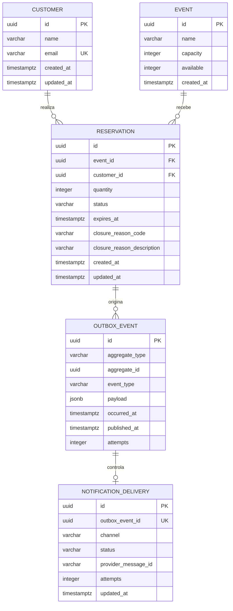

# Modelagem de dados

O PostgreSQL é a fonte autoritativa nas duas arquiteturas. A demo usa RDS PostgreSQL e a arquitetura de alta carga usa Aurora PostgreSQL compatível; tabelas, constraints, índices e migrations são os mesmos.

## Relações



`IDEMPOTENCY_RECORD` não aparece no diagrama de domínio porque controla comandos HTTP, não a relação entre eventos, clientes e reservas. Ele contém `idempotency_key`, `operation`, `normalized_target`, `payload_hash`, `response_status`, `response_body`, `created_at` e `expires_at`. A chave é globalmente única enquanto a linha representa a janela atual; operação, alvo e hash são a impressão digital. A aquisição usa a própria unicidade para inserir uma chave nova ou substituir atomicamente uma linha vencida, preservando um único executor mesmo quando duas instâncias disputam a reutilização.

## Entidades e responsabilidades

### Customer

- `id: UUID`: identidade interna estável.
- `name: String`: nome usado na comunicação.
- `email: String`: único endereço persistido. Antes da validação e persistência, o código Java remove espaços externos e converte o valor para minúsculas com `Locale.ROOT`.
- `createdAt: Instant` e `updatedAt: Instant`: auditoria técnica.

O cliente não é o usuário IAM que invoca a API. O primeiro é o titular da reserva; o segundo é o operador autorizado da demonstração. `POST /events/{id}/reservations` recebe nome e e-mail; o Java transforma o endereço em sua forma canônica e persiste somente esse valor em `email`. O comando cria ou reutiliza o cliente por essa coluna e usa seu `id` na reserva. O upsert é atômico pela chave única; se o e-mail já existir, atualiza o nome e `updatedAt`, evitando falha em duas reservas concorrentes do mesmo cliente. Não há endpoint de cliente.

### Event

- `id: UUID`.
- `name: String` entre 1 e 200 caracteres após remoção de espaços externos.
- `capacity: int` maior que zero e imutável após a criação.
- `available: int` entre zero e `capacity`.
- `createdAt: Instant`.

`available` é o estoque autoritativo. O valor em Valkey é apenas disponibilidade exibida e nunca participa da autorização da reserva.

### Reservation

- `id: UUID`.
- `eventId: UUID`: chave estrangeira obrigatória para `Event`.
- `customerId: UUID`: chave estrangeira obrigatória para `Customer`.
- `quantity: int`: maior que zero.
- `status: PENDING | CANCELLED | EXPIRED`.
- `expiresAt: Instant`: posterior a `createdAt`, calculado pelo servidor.
- `closureReasonCode` e `closureReasonDescription`: nulos em `PENDING`, obrigatórios e imutáveis em estados terminais.
- `createdAt: Instant` e `updatedAt: Instant`.

Uma reserva pertence a exatamente um cliente e um evento. Um cliente pode realizar várias reservas; um evento pode receber várias reservas. Não existe estado de compra confirmada porque pagamento está fora do case.

### OutboxEvent e NotificationDelivery

`OutboxEvent` preserva atomicidade entre a reserva e os fatos que precisam sair do banco. `ReservationCreated` alimenta a fila de notificação e `ReservationExpirationScheduled` alimenta a fila de expiração. `NotificationDelivery` registra tentativas conhecidas de e-mail e impede o reprocessamento normal do mesmo evento; não promete exatamente uma entrega diante de resposta ambígua do SES.

## Constraints que defendem o domínio

- `event.capacity > 0`.
- `event.available >= 0 AND event.available <= event.capacity`.
- `reservation.quantity > 0`.
- `reservation.expires_at > reservation.created_at`.
- `PENDING` exige motivo nulo; `CANCELLED` e `EXPIRED` exigem código e descrição não vazios.
- `CANCELLED` aceita somente `CANCELLED_BY_REQUEST`; `EXPIRED` aceita somente `RESERVATION_DEADLINE_REACHED`.
- chaves estrangeiras de reserva usam exclusão restrita: evento ou cliente com reserva não é apagado em cascata.
- `customer.email` é único e recebe somente o valor já tratado pelo código Java.
- `notification_delivery.outbox_event_id` é único.

## Índices derivados dos acessos

| Índice | Consulta protegida | Justificativa |
| --- | --- | --- |
| `reservation(event_id, status)` | reservas ativas por evento e diagnóstico de contenção | Evita varredura ampla em operação e suporte. |
| `reservation(customer_id, created_at desc)` | histórico futuro do cliente | Mantém o relacionamento navegável sem criar endpoint agora. |
| `reservation(expires_at) WHERE status = 'PENDING'` | reconciliador de expiração | Mantém a varredura de vencidas pequena. |
| `outbox_event(occurred_at) WHERE published_at IS NULL` | publicação pendente | Evita reler eventos já publicados. |
| `idempotency_record(expires_at)` | seleção de registros vencidos | O cutoff estável `statement_timestamp()` permite acesso por índice; o worker limpa, por padrão, até 500 linhas por rodada e a aquisição continua decidindo a validade. |

## Escritas concorrentes e prevenção de oversell

Criar uma reserva executa, na mesma transação, o upsert do cliente e uma atualização condicional equivalente a `UPDATE event SET available = available - :quantity WHERE id = :eventId AND available >= :quantity`, seguida do vínculo `Reservation -> Event -> Customer` e do outbox. Se nenhuma linha for atualizada, a transação inteira é desfeita, retorna `409` e não persiste cliente, reserva nem evento de outbox.

Cancelar ou expirar primeiro conquista a transição condicional `PENDING -> estado terminal`. Somente a transação que alterar uma linha incrementa `available` pela quantidade reservada. Repetição, entrega duplicada, cancelamento concorrente e disputa entre cancelamento e expiração afetam zero linhas e não devolvem ingressos novamente. O banco serializa alterações na mesma linha do evento; em carga extrema a latência pode crescer, mas o estoque não fica negativo nem supera a capacidade.

## Contrato HTTP relevante

Corpo mínimo de criação de reserva:

```json
{
  "quantity": 2,
  "customer": {
    "name": "Cliente da demonstração",
    "email": "cliente@example.com"
  }
}
```

A consulta da reserva retorna `customer`, `event: {id, name}`, `quantity`, `status`, `expiresAt` e `closureReason`. Capacidade total e disponibilidade atual pertencem a `GET /events/{id}` e não são duplicadas na resposta da reserva. A consulta não usa cache e não retorna campos internos de idempotência, outbox ou entrega de notificação.

## Proteção de dados

Nome e e-mail são dados pessoais. Controllers validam tamanho e formato; logs usam apenas `customerId`, `reservationId` e e-mail mascarado. Mensagens SQS carregam apenas o necessário para o e-mail. Banco, filas e cache permanecem criptografados e privados. A política de retenção de longo prazo e o direito de exclusão pertencem a uma evolução de produto, pois a demonstração será destruída após o uso.
